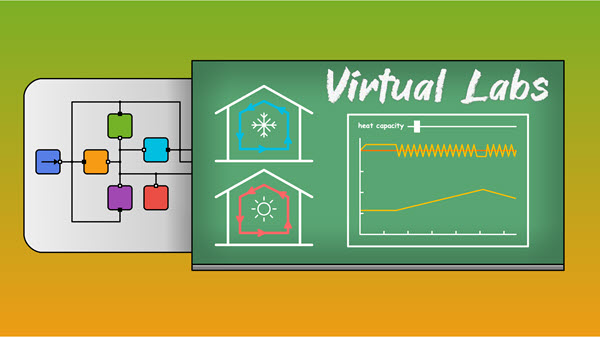

How can you make teaching come alive and be more engaging? For many educators, the answer turns out to be not so much a single solution, but rather a set of tools that can vary according to subject and even by student. Wolfram has now added a new tool to the pedagogical toolkit: Wolfram Virtual Labs.

These are:

- Open education resources (OER).
- Designed to encourage student curiosity by allowing students to test ideas with immediate feedback in a programmatic environment.
- Created to make memorization easier.

The following Virtual Labs libraries are now available for download from the SystemModeler library store:

- CollegeThermal: Developed in collaboration with Politecnico di Torino. Contains interactive thermal labs related to heat transfer and thermal engineering courses.
- HighSchoolBiology: Developed in collaboration with Linköping University and VicSTEM. Contains interactive biology labs related to cell transport phenomena, population models and food metabolism.
- HighSchoolChemistry: Developed in collaboration with Linköping University Contains interactive chemistry labs related to rate laws, homogenous reactions and heterogenous reactions.

Stay tuned for upcoming libraries, including:

- HighSchoolPhysics
- CollegeElectricalAnalog
- CollegeMechanicalEngineering

The labs are developed using Mathematica notebooks with Modelica models running in the background. For more information, please read the CollegeThermal release blog.

 Click here to read the latest SystemModeler news.
