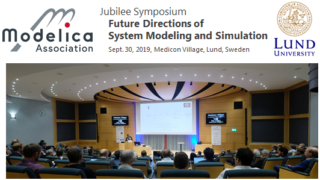

 

The [Modelica Association](https://www.modelica.org/), Modelica companies in Lund and
[Lund University](https://lunduniversity.lu.se/) organized a free Jubilee Symposium
on Sept. 30, 2019, to celebrate the 100th Modelica Design Meeting that took place in Lund
on October 1-2, 2019. The first Modelica Design Meeting was organized in Lund in September 1996.

In nine presentations, invited researchers and industrial practitioners from different communities 
with a common interest in modeling and simulation presented their view on 
status, trends and forthcoming developments in this field. 
The very nice lecture auditorium of Medicon Village near Lund University was a perfect location
for this event. With 140 available seats for the 140 registered participants, the room was fully occupied.

**Slides** and **videos** of the presentations are available from the 
[Symposium Program](https://modelica.github.io/Symposium2019/program.html) web page.

In the evening a Modelica history session took place during the dinner.
Inspirations, events and persons have been presented from Modelicas' root in 1861 until today. 
The slides of this session and pictures of the event are also available from the
[Symposium Program](https://modelica.github.io/Symposium2019/program.html).
