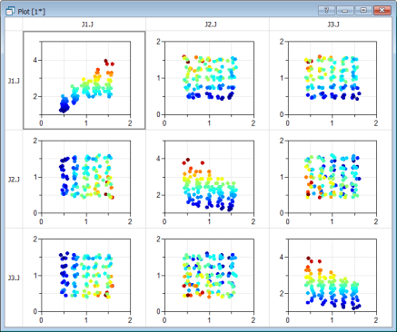

Dymola 2021 will be generally available in May 2020. There are several key improvements in simulation performance and robustness. It is also possible to create snapshots of the result while simulating and to control the output interval from the model. Parameter sweeping can now handle more than two parameters. Furthermore, there are improvements in simulation analysis and profiling.

The new ribbon-based user interface that was introduced in Dymola 2020x has been further refined; the model tabs have been moved to the top of the model window. The plotting capabilities have been generalized to allow a matrix of plots in each window, and to provide additional result documentation for each plot window. A Moving Average operator allows smoothing of signals.

