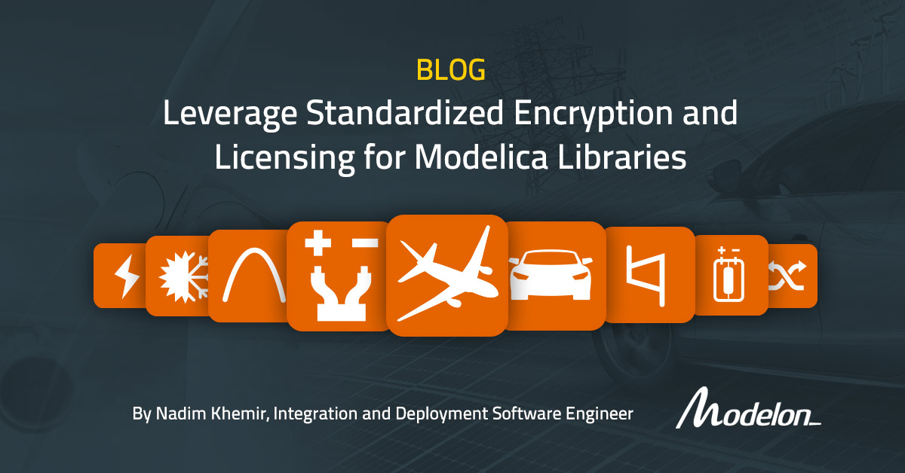

#### Open Source Encryption Standard Designed by Modelon
SEMLA (Standardized Encryption of Modelica Libraries and Artifacts) is a system for distributing proprietary Modelica libraries which supports:
-	Encryption
-	Licensing
-	Secure decryption of encrypted Modelica libraries
-	Platform independence
Libraries are bundled in the MLC (Modelica Library Container) format, which are zip files containing the encrypted libraries and a manifest.
SEMLA was designed by Modelon developers to be an open source encryption standard, which allows library vendors to protect the intellectual property contained within their Modelica libraries. SEMLA can also prevent libraries from being copied and re-used by other Modelica users unless authorized by the library vendor.

#### SEMLA Interface
The SEMLA protocol allows a library vendor to access licensed and encrypted Modelica libraries via an LVE (Library Vendor Executable) interface, using a secure communication channel. The LVE is controlled by the library vendor and allows the vendor to choose which licensing and encryption schemes, if any, will be implemented in the protocol.
The communication channel is secured with an SSH 1.1 connection. This connection allows the LVE to communicate with a single or multiple authenticated Modelica tools. The library vendor can also create different LVE interfaces for each of their customers, with different licensing and encryption parameters for each instance, if so desired.
The SEMLA system also includes source code for a platform-independent utility called packagetool. The packagetool utility can be used to scan the Modelica libraries, encrypt the contents and create the MLC.

#### Learn More about the SEMLA Protocol
The SEMLA protocol is an open source project. Modelon has documented detailed specifications for the protocol in Tool-Independent Licensing and Encryption of Modelica Libraries.
