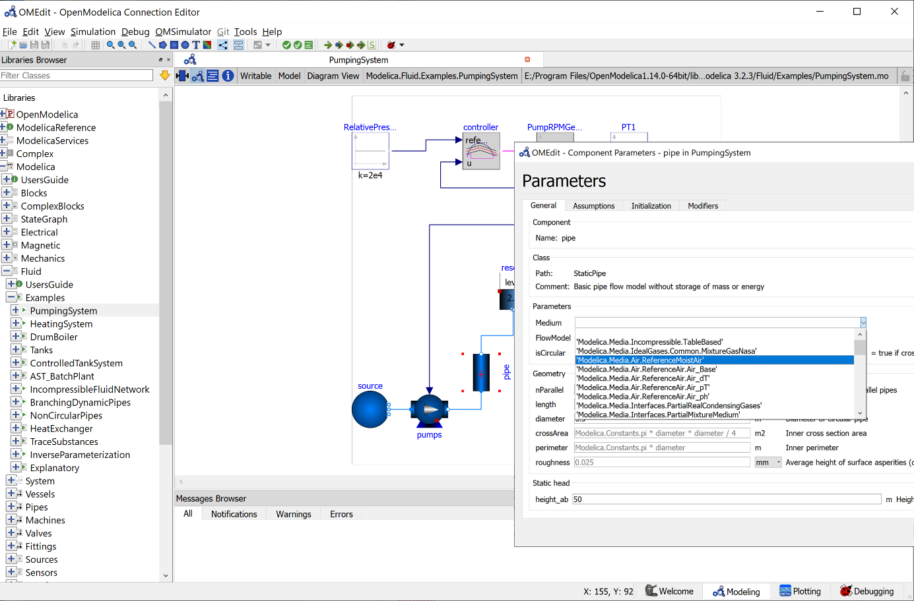

OpenModelica is the most complete open-source Modelica-based cyber-physical mathematical modeling,
simulation and optimization environment intended for industrial and academic usage.
Its long-term development is supported by a non-profit organization – the Open Source Modelica Consortium [OSMC](https://www.openmodelica.org/)
with many company, institute, and university members.

The figure shows OpenModelica while editing pump component inside PumpingSystem.

The OpenModelica 1.15.0 Beta1 release has been made available for testing. The main enhancement in this release is the graphical user interface support of replaceable items in libraries. The speed of the OMEdit GUI has also increased in this release. 

This release is also using a further improved version of the OpenModelica Compiler New Frontend (NF), which on the average gives a factor of 10-20 speed improvement in the flattening phase of compilation compared to the old frontend. The new frontend is default also in this release. See www.openmodelica.org for download.

