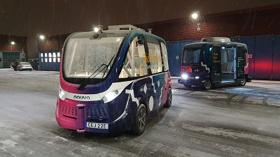

The 14th international MODPROD Workshop on Model-Based Cyber-Physical Product Development, organized by the MODPROD competence center at Linköping University, was successfully held at Linköping University, Linköping, Sweden, February 4-5, 2020.

Three tutorials were held in the morning the first day on the topics: Introduction to Modelica modeling, debugging, optimization/sensitivity analysis; FMI for composite modeling, co-simulation and model-exchange; Modeling and simulation of Power Systems with OpenModelica and the PowerGrids library.

Four keynotes were given:

-	Peter Gorm Larsen, Professor at Aarhus University, Head of Digit Centre. “A Cloud-based Collaborative Platform for Model-Based development of Cyber-Physical Systems”
-	Richard Romano, Professor at University of Leeds, Chair in Driving Simulation. “Model based design of Automated Vehicles”
-	Gunnar Cedersund, Associate Professor at Linköping University, leader of Systems Biology group, “A digital twin for the human body: from data and validation to end-usage in healthcare and drug development”.
-	Juan Llorens, Professor at the Informatics Dept., Univ of Madrid, President of INCOSE Spain, CTO of REUSE company. "Knowledge Management and reuse in the context of Systems Engineering”.

The program and the presentations are available at [MODPROD website](http://www.modprod.liu.se).

{:width="45%"} {:width="45%"} 

**Left:** Robert Braun and Ingo Staack (Linköping University), chairpersons.  
**Right:** Peter Gorm Larsen (Aarhus University) gives his keynote on a cloud-based collaborative platform for CPS,including examples of digital twins.  

{:width="45%"} {:width="45%"} 

**Left:** Technical visit to the Road and Traffic Institute showing the project regarding self-driving buses at Linköping University campus.  
**Right:** Gunnar Cedersund (Linköping University) presents his keynote including the new digital twin healthcare revolution – Mechanistic, Multi-level, Multi-timescale, Multi-species models.
