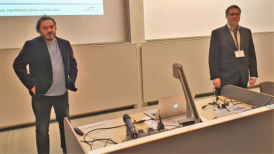
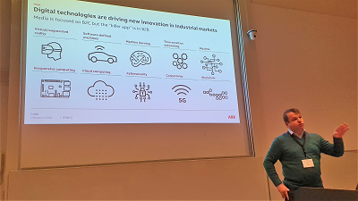

The 12th OpenModelica Annual Workshop organized by the Open Source Modelica Consortium was held successfully in Linköping, Sweden, on February 3, 2020. New results and applications regarding the OpenModelica platform were presented, including status and directions of OpenModelica, modeling and simulation of innovative power generation, Modelica in the digital world, efficient minimal tearing of hybrid algebraic loops, use of DAEMode for simulation of industrial power generation system simulation, generation of symbolic Hessian matrices, virtual automation lab using Unity 3D, current technical status of OpenModelica, experiments with a prototype OpenModelica compiler in Julia, simulation of switching dynamics of electromagnets, FMI and SSP developments, sensitivity analysis and non-linear optimization with OMSens, a library for learning power systems modeling.

The program and the 13 presentations are available from [openmodelica.org/events/openmodelica-workshop/openmodelica-program-2020](https://www.openmodelica.org/events/openmodelica-workshop/openmodelica-program-2020)  

{:width="45%"} {:width="45%"}

**Left:** Adrian Pop and Martin Sjölund, OpenModelica workshop chairpersons (Linköping University) opening the workshop.  
**Right:** Rüdiger Franke, OSMC Chairman (ABB AG) presenting how digital technologies are driving new innovations in industrial markets.  
