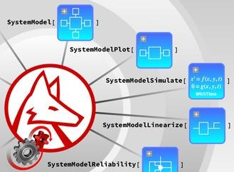

*System Modeler and Mathematica 12.1 have been released earlier this month*

The latest version of System Modeler contains many new features to make your design process more efficient. Some of the highlights are:

- *Better Error Reporting*–Find and fix errors in your model with the addition of hyperlinks and easy-to-read errors and warning messages.
- *Simplified Creation of Configurable Models*–Easily create your configurable models with the improved user interface. 
- *Quickly Analyze Simulations*–Find the plotted values for any point in time, or click and drag to select and compare plotted values between times using the new Measurement window.

Read more about the [latest updates and download a trial here](https://www.wolfram.com/system-modeler/what-is-new/).

*Powering Engineering Education with Wolfram Virtual Labs*

The following new Virtual Labs’ library is now available for download from the [System Modeler library store](https://www.wolfram.com/system-modeler/libraries/):

[CollegeBiology](https://www.wolfram.com/system-modeler/libraries/college-biology/): Developed in collaboration with [Linköping university](https://liu.se/) contains interactive biology labs related to PCR, electrophoresis and autosomal recessive disease.

The labs are developed using Mathematica notebooks with Modelica models running in the background. For more information please read [this blog](https://blog.wolfram.com/2019/10/08/powering-engineering-education-with-wolfram-virtual-labs/).

[Click here](https://www.wolfram.com/system-modeler/what-is-new/) to read the latest System Modeler news.
