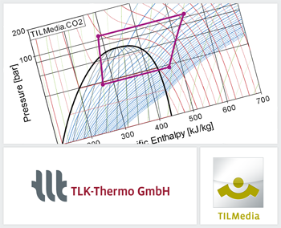

{::options parse_block_html="true" /}

The TILMedia Suite provides calculation methods that describe the thermophysical properties
of liquids, gases, real fluids with wet steam region and mixtures. These properties are
calculated very quickly and accurately based on our optimized mathematical methods. Thanks
to its many interfaces, TILMedia is available in various programs and languages (Dymola,
SimulationX, Excel, LabVIEW, MATLAB, Simulink, Python, C++ and others).

The TILMedia Suite is continuously developed and contains several hundred different media
models (R-134a, R-1234yf, CO2, humid air, water-glycol etc.) from different publications
and sources, among them: TLK-Thermo, REFPROP, VDI Wärmeatlas, VDI 4670, CoolProp and
NASA Glenn Coefficients.

The current **version 3.8.0** provides besides speed improvements in substance data calculation
also new features, of which a small selection shall be mentioned here:

 - New substance data model for H2: The TILMedia Suite was extended by the VLEFluid model
   TILMedia.Hydrogen. With this model, substance properties e.g. for liquefaction or at high
   pressures (up to 1000bar) can be calculated according to scientific standards.
 - Faster calculation of VLEFluid objects: The calculations of the partial density derivatives
   in VLEFluid objects can be deactivated, which results in a significantly higher overall
   calculation speed.

For further information see [www.tlk-thermo.com](https://www.tlk-thermo.com/index.php/en/tilmedia-suite), [download the TILMedia presentation](https://www.tlk-thermo.com/images/tlk/content/presentations/TILMedia_Suite_EN_2019_September.pdf) or contact us at [tilmedia@tlk-thermo.com](mailto:tilmedia@tlk-thermo.com).
