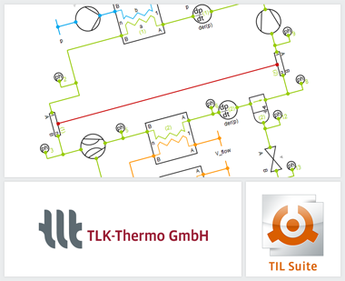

{::options parse_block_html="true" /}

The TIL Suite is a comprehensive Modelica library for stationary and transient simulations
of thermodynamic systems. The current **version 3.8.0** contains the following innovations and
improvements:

 - Homotopy: The new version uses the Modelica Homotopy function in many TIL models. This
   function converts simplified model equations into the actual physical equations before
   the simulation starts, resulting in a very robust and stationary initialization. This
   alternative initialization method allows fast calculation of many different steady-state
   operating points within a parameter study. Furthermore, the homotopy initialization
   allows the simulation start from a defined stationary state at given boundary conditions.
 - TIL 3.8.0 HD: The new variant of TIL "TIL HD" was developed for the calculation of highly
   dynamic simulations. The advantages are noticeable in case of strongly changing boundary
   conditions, switch-off and changeover processes with zero mass flows, controller tests
   and real-time simulation. With TIL HD the simulation of systems with changing modes of
   operation (e.g. switching between air conditioning and heat pump operation) is possible
   on the basis of a single FMU. Please contact us if you are interested.

For version 3.9.0, which will be released in April 2020, we would like to present a selection
of the new features that will be featured in this release:

 - New capillary tube model: With the new capillary tube model, the component library gets
   another representative from the area of valves. After only a few user inputs to parameterize
   the model, it is possible to simulate refrigeration cycles of refrigerator systems.
 - New Examples: The "TIL Examples" are extended by several systems. For example, there will
   be a refrigerator system, which already contains the new capillary tube model, and a
   hydrogen filling station system, which uses the new substance data model TILMedia.Hydrogen.

For further information see [www.tlk-thermo.com](https://www.tlk-thermo.com/index.php/en/til-suite), [download the TIL presentation](https://www.tlk-thermo.com/images/tlk/content/presentations/TIL_Suite_EN_2020_January.pdf) or contact us at [til@tlk-thermo.com](mailto:til@tlk-thermo.com).
