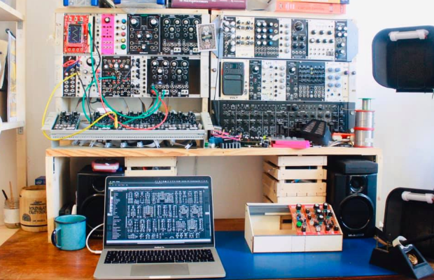

Have you ever thought about making your own musical instruments? What about making mathematical models of your instruments? Whether you're someone looking for a cost-effective alternative, a minimalist with dreams of maximalist sounds or a Wolfram Language enthusiast curious about sound design, you can build a virtual version of a modular synthesizer using Wolfram System Modeler.

[Click here](https://blog.wolfram.com/2020/07/23/digital-vintage-sound-modeling-analog-synthesizers-with-the-wolfram-language-and-system-modeler) to read the entire blog.
