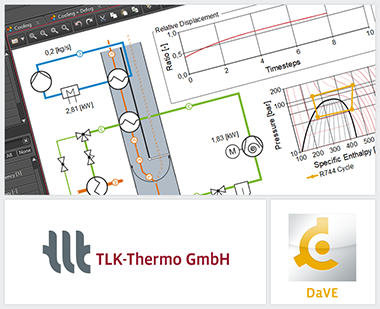

{::options parse_block_html="true" /}

DaVE is a visualization and simulation environment that is suitable for both the post-processing and the online display of dynamic data. The current **version 2.2** includes new developments and improvements, of which a small selection shall be mentioned here:

 - New Round Instrument Variant: Additionally to the standard Round Instrument a smaller variant has been implemented. This version is well suited for configurations with many instruments.
 - Improved State Chart Instrument: State Points can now be added and edited via mouse. This makes the creation and editing of cycles quick and convenient.
 - TILMedia Version 3.9.0: The newest version of TILMedia has been implemented.
 - Network License: DaVE is now capable to use borrowed network license.

For further information see [www.tlk-thermo.com](https://www.tlk-thermo.com/index.php/en/dave), [download the DaVE presentation](https://www.tlk-thermo.com/images/tlk/content/presentations/DaVE_EN_2019_September.pdf) or contact us at [dave@tlk-thermo.com](mailto:dave@tlk-thermo.com).
