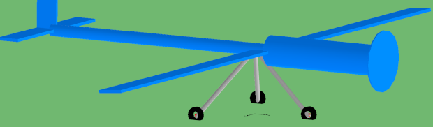

The new Aviation Systems Library (ASL) offers models for the aerodynamic behavior of aircrafts like airplanes or multi-copters. It uses standard MSL physical connectors to allow the design of propulsion systems with other libraries like the Electrical Powertrains Library (EPTL) considering the effects of the flight mission on the performance. Being fully integrated into the MSL MultiBody environment, all potential of Modelica libraries can be utilized.
In this first release, two main topics are covered:
 - Longitudinal dynamics of airplanes (fixed-wing) for designing a propulsion system considering the flight mission
 - Full dynamics of multi-copter drones (rotating-wing) including the control system for mission planning and design of the propulsion system
The two areas share common models like propulsion or landing gear systems.  Components of the electric drive are structured in a reasonable way to allow replacing by custom drive systems from other libraries:

{:width="623px"}

The aerodynamic forces of wings or propeller blades are calculated by table-based profile polar curves. Geometrical arrangement of the aerodynamic objects to model an aircraft is conducted in the Modelica MultiBody environment. A simple tire model allows take-off from ground and landing:

{:width="623px"}
