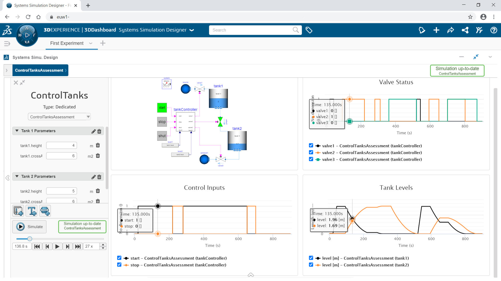

---
title: 3DExperience Systems Simulation Designer
author: "Alexandre Cortina ([Dassault Systemes](https://my.3dexperience.3ds.com/welcome/))"
category: "vendor"
---

Systems Simulation Designer is a new web based tool available now on the DASSAULT SYSTEMES Cloud.

{:width="623px"}

The goal of this new tool is to allow domain experts to create multi-physics simulation models using Modelica libraries and share ready-to-use experiments in the overall company for systems assessment and tradeoff analysis:
* Fast deployment without software installation accessible from a web browser
* Compose a model based on existing libraries
* Modelica modeling flexibility, including changes to structural parameters and redeclaration of models and components
* Setup all the pre and post processing to simplify the models for other users. For example, defining parameter ranges, creating a list of important parameters for a dedicated model, defining important plots
* Create a simulation cockpit or simulation dashboard, which is a simplified view of the simulation with parameters, animation and results available in a single page
* Provide fast model execution  using the DASSAULT SYSTEMES cloud computing
* Distribute knowledge of simulation based on Modelica

