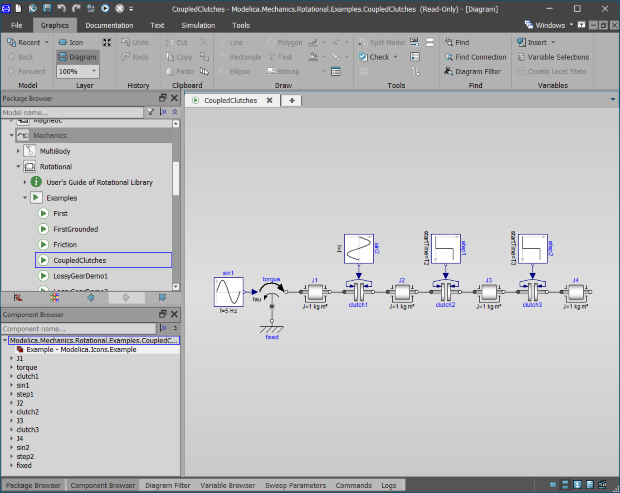

---
title: Dymola 2021x
author: "Dag Brück ([Dassault Systemes](http://www.3ds.com/dymola))"
category: "vendor"
---

We are delighted to announce that Dymola 2021x is available. [Latest Release](https://www.3ds.com/products-services/catia/products/dymola/latest-release/)

#### Editing and user interface

Importing FMU code modules is common. It is now possible to precisely control which FMU signals should be exposed or hidden, making the interface easier to use. When drawing diagrams, connections can be automatically routed to avoid existing components. On popular request, Dymola can be run in “dark” mode for a more sophisticated experience.

#### Simulation

Static simulation (initialization) has become up 2x faster for many common types of models. To help understand the model’s behavior, equation systems can be visualized with an incidence graph.

#### Model libraries

The Modelica Standard Library 4.0.0 is the default in Dymola 2021x. Automatic conversion scripts are applied when opening models that used MSL 3.2.3.
The new Aviation Systems Library models propulsion and aerodynamics of fixed-wing and rotary-wing aircraft.
