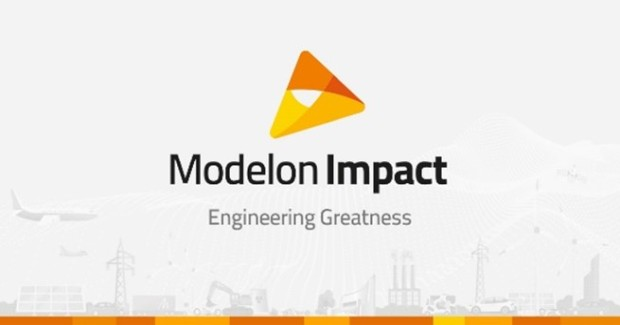

Modelon Impact is an open, cloud-ready, collaboration-friendly multi-domain modeling platform. It is built on the open standards of Modelica, and unified under a single user interface that teams can use across an entire organization. Every department across an entire organization can collaborate and co-develop from the start, implicitly relying on the same "single-source of truth," and thus reducing miscommunication, last-minute-fixes, and busy work. We are proud to offer this modern user experience and it is simply the beginning – we’re just getting started. 

Learn more: [www.modelon.com/modelon-impact-introduction/](https://www.modelon.com/modelon-impact-introduction/)

Modelon also offers [free on-demand webinar](https://www.modelon.com/support/modelon-impact-webinar-2020/) providing an overview and demonstration of Modelon Impact. 

The second [on-demand webinar](https://www.modelon.com/support/aerospace-system-design-webinar-on-demand/) offers an overview and demonstration of Modelon Impact as the solution for implementing model-based design methods and digital thread. 
