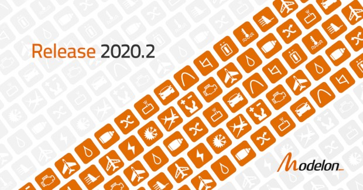

Modelon is pleased to announce the 2020.2 release is now available for Modelica libraries within the Modelon Library Suite. As part of our multi-platform strategy, select Modelon technology is available in an expanding list of platforms. View the complete list [here](https://www.modelon.com/products-services/modelon-inside/). 

#### 2020.2 Highlights

Automotive

- Added capability to deploy Vehicle Dynamics Library vehicle models in VI-Grade’s eco-system of driving simulators
- Improved cyclic battery aging models, new electric vehicle model range example
- Support for sequential transmissions
- New thermal expansion valve, improvements in gas mass calculations, flow source connections user friendliness connection improvements

Aerospace

- Physics-based Solving technology implemented into Jet Propulsion Library enhancing steady-state simulation, documented in a new tutorial on specific Turbojet example
- New bend models with examples, new Ejector in Fuel System Library
- Improved user friendliness by restructuring ambient models and multi-pressure boundary connectors
- Single acting cylinder model, improved cavitation, mixing and friction models in Hydraulics Library

Energy & Power

- Microgrid demonstrator (model, notebooks, web apps) – complete workflow
- Thermal Power Library significantly modernized (structure & calc. stability) with several new components and examples related to hydrogen combustors, economizer calibration, heat recovery steam generator design and water steam cycle calibration
- Spline-based Table-lookup Media Creator 
- New capillary Tube model, two-phase-gas counter-flow heat exchanger for residential AC

To access the new release, [contact our team](https://www.modelon.com/contact-us/).
