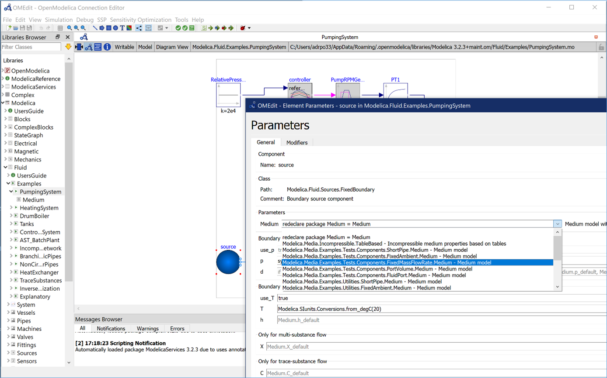

OpenModelica is the only actively maintained complete open-source Modelica-based cyber-physical mathematical modeling, 
simulation and optimization environment intended for industrial and academic usage. 
Its long-term development is supported by a non-profit organization–the Open Source Modelica Consortium [OSMC](https://www.openmodelica.org/)
with many company, institute, and university members.

The figure shows OpenModelica while editing Modelica.Fluid component parameters, using the replaceable GUI.

OpenModelica 1.16.2 has been released. This is a bug fix release to the recently released OpenModelica 1.16.0, primarily to improve the stability of the OMEdit GUI. The main enhancement in the 1.16.0 release (see [release notes](https://trac.openmodelica.org/OpenModelica/wiki/ReleaseNotes/1.16.0)) is the graphical user interface support of replaceable items in libraries. The new frontend has been further improved with enhanced support of records and arrays. The new front-end can now handle 100% of the Modelica Standard Library 3.2.3 models. Also improvements to backend and simulation run-time regarding homotopy, CVODE solver included, new minimal tearing, better support for models with records, enhanced OpenModelica debugger that can show direct variable dependencies, a full-fledged Modelica package manager is included, initially available via the command line interface, and more.

Further improved FMI support in OpenModelica OMSimulator: GUI: text editing of SSP models, undo/redo functionality, delete components, etc. FMI/CoSimulation 2.0 now includes CVODE solvers and customization via simulation flags. SSP 1.0 is supported. See [www.openmodelica.org](https://www.openmodelica.org/) for download.

