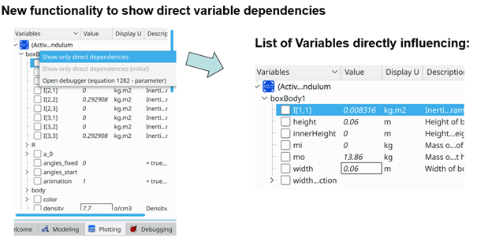

The equation model debugger in the recent OpenModelica 1.16.0 release and in the 1.16.2 bugfix release is enhanced with new functionality to help the user understand sources of model errors.

The figure shows the debugger tracing how variables or equations influence a variable.\
Left: Turn on the menu choice. Right: List of variables directly influencing the chosen variable.

The new functionality allows the user to perform a “backward” trace of which variables or equations that directly influence a chosen variable (see figure). This can be useful to understand the dependencies causing a faulty variable value.

See www.openmodelica.org for download.
