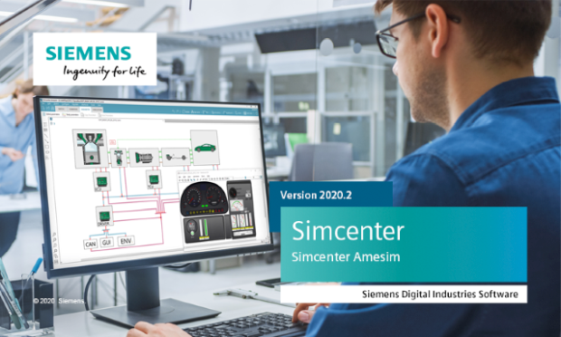

[Siemens Digital Industries Software](https://www.sw.siemens.com/ ) is proud to announce the recent release of [Simcenter Amesim 2020.2](https://www.youtube.com/watch?v=URHoN-yy_bk ), as part of its system simulation solutions. Among the key features introduced in this release, we can highlight the FMI and Modelica related improvements below.

# Modelica updates
As announced in the previous issue of this newsletter, the Modelica Editor has been extended with the following capabilities:
* Modelica Compiler (Modelon's [Optimica Compiler Toolkit](https://www.modelon.com/products-services/modelon-creator-suite/optimica-compiler-toolkit/ )) upgraded to version 1.18
* Extended variable filtering capabilities for the simulation: black-box and GLOB patterns support
* Increased translation logging usability 

# FMI updates
A new ONNX to FMI conversion tool has been introduced. It allows exporting FMUs from [ONNX](https://onnx.ai/ ) files containing neural networks (surrogate models) generated by Simcenter&nbsp;Amesim itself, using the Neural Network Builder tool, or coming from other [ONNX](https://onnx.ai/ ) compatible software. The generated FMUs comply with version 2.0.1 of the specification and support the following advanced capabilities: 
* Capabilities common to model exchange and co-simulation 
  * Save and reload model states
  * Multiple instantiation
  * 32-/64-bit Windows/Linux binaries
  * Source-code provided (unique C file)
  * Documentation including ONNX graph
  * Initialization via start values and/or inputs
* Model exchange specific capabilities 
  * Generation of FMUs with or without event handling
* Co-simulation specific capabilities
  * Variable-step co-simulation (for static neural networks)

This new tool represents a first step towards the deployment of highly portable lightweight but accurate representations of physical models&nbsp;&mdash;&nbsp;executable digital twins&nbsp;&mdash;&nbsp;on a wide variety of targets (e.g. IIoT, Edge Computing or Cloud platforms), to serve various kinds of simulation contexts and purposes.

More will come in the next Simcenter&nbsp;Amesim releases with the end of the [EMPHYSIS](https://itea3.org/project/emphysis.html ) European projet from which [Siemens Digital Industries Software](https://www.sw.siemens.com/ ) is a member, and with the future release of FMI 3.0 to which Siemens also actively contributes.   

For more information on Simcenter Amesim, 
please visit our [website](https://www.plm.automation.siemens.com/global/en/products/simcenter/simcenter-amesim.html ).
