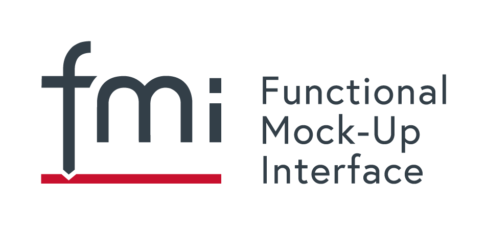

{::options parse_block_html="true" /}

#### Updated Cross-Check-Rules

The FMI Steering Committee has passed an [updated version 4.1 on the FMI Cross-Check Rules](https://github.com/modelica/fmi-cross-check/blob/master/FMI-CROSS-CHECK-RULES.md), which includes the following changes:

- The FMI Steering Committee revised its decision to introduce fees for listing in the FMI Cross-Check tables: there will be no listing fees for Cross-Check results.
- The FMI Steering Committee decided to reduce the required proof for import results to the self-assessment passed/failed files. This will help reduce the space requirements for the Cross-Check repository without practically reducing the quality of the results. Existing result files for importers will be removed by the project factotum without further notice.

#### Online FMU Checker

There is a prototype of a new online check of FMUs available, see https://fmi-standard.org/fmu-check/.
FMU Check performs a static analysis of the FMU that validates the following aspects:

- validity of the modelDescription.xml w.r.t. the XML schema
- uniqueness and validity of the variable names
- completeness and integrity of the Model Structure
- availability of the required start values
- combinations of causality and variability
- definition of units

It does not check the following aspects:

- validity of the binaries
- validity of the sources
- any non-standard files inside the FMU
- execution of the binaries / simulation of the FMU

This new online FMU Check is based on FMPy, a Python library by Dassault Systèmes to validate and simulate FMUs that has a graphical user interface, compiles C code FMUs and generates CMake projects for debugging, see https://github.com/CATIA-Systems/FMPy
The online FMU checker complements the checking of FMUs with FMPy or the [FMU Compliance Checker](https://github.com/modelica-tools/FMUComplianceChecker), a command line tool based on the FMI Library developed by Modelon AB to validate and execute FMUs.

#### Maintenance release FMI 2.0.2

The FMI project is planning a maintenance release FMI 2.0.2 with bugfixes and introducing the /extra directory in FMI 2.0 (already there in SSP, and to come in FMI3.0).
The release process has started, voting in the FMI Steering Committee and Modelica Association has been initiated.
The release candidate is and the released version will be available [here](https://github.com/modelica/fmi-standard), where also the changes are listed.

#### FMI 3.0

You can follow the development of FMI 3.0 on [Github](https://github.com/modelica/fmi-standard) and inspect the latest development version [here](https://fmi-standard.org/docs/3.0-dev/).
