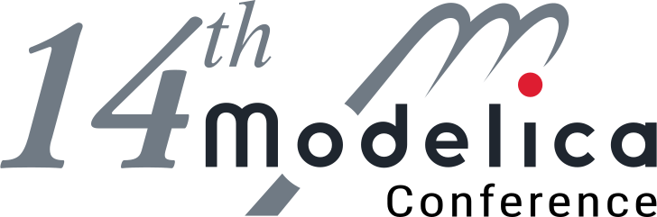
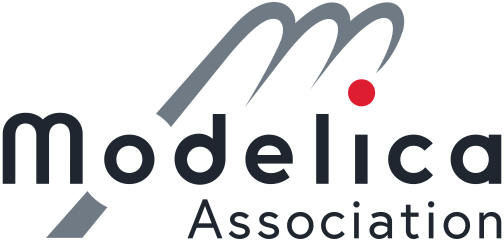
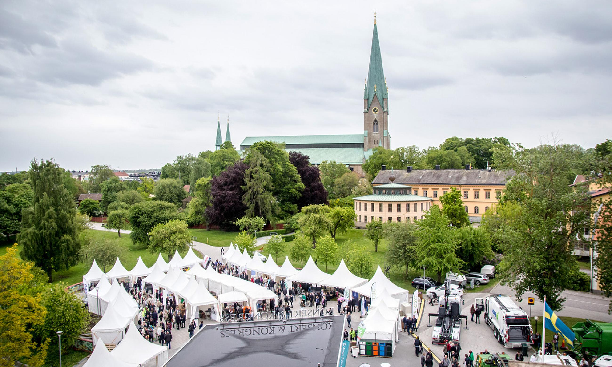

| [{:width="320px", :height="400px"}](https://2021.international.conference.modelica.org) | [{:width="160px", :height="200px"}](https://modelica.org)   [{:width="160px", :height="200px"}](https://www.ida.liu.se/~pelab)  |

The **14th International Modelica Conference** will be a hybrid remote and physical event, held at [the concert and conference hall in Linköping](https://konsertkongress.se/en/start), **September 20–22, 2021**. It is organized by [Linköping University](https://liu.se/), in cooperation with the Modelica Association.   Join us in [Linköping](https://visitlinkoping.se/) in person or from the comfort of your own home.|

#### Call for Papers

The Modelica Conference will cover modeling of complex physical and cyber-physical systems as well as tools, for a wide range of research and industrial applications. The Modelica Conference is the main event for users, library developers, tool vendors and language designers to share their knowledge and learn about the latest scientific and industrial progress related to Modelica and to the Functional Mockup Interface (FMI). More information is found on the [conference page](https://2021.international.conference.modelica.org).

You are encouraged to submit a full paper until April 26, 2020. Every submitted paper will be reviewed by 3 reviewers. More details about the calls for [papers, libraries, user presentations](https://2021.international.conference.modelica.org/call2021.html) and [vendor presentations, exhibitors, sponsors](https://2021.international.conference.modelica.org/othercalls.html).

We are looking forward to seeing you in Linköping.

[{:width="640px", :height="400px"}](https://konsertkongress.se/en/start)

#### Contact

For general questions, please send an email to: **[modelica2021@groups.liu.se](mailto:modelica2021@groups.liu.se)**

#### Conference Chairs

- Main contact: Lena Buffoni, Linköping University
- Lennart Ochel, RISE Research Institutes of Sweden AB

#### Program Chairs
- Martin Sjölund, Linköping University
- Adrian Pop, Linköping University

