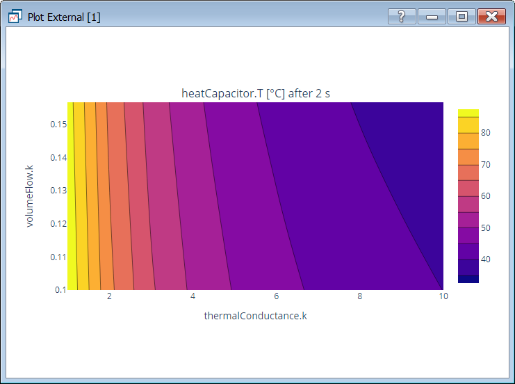

---
title: Announcing Dymola 2022
author: "Dag Brück ([Dassault Systemes](http://www.3ds.com/dymola))"
category: "vendor"
---

We are delighted to announce that Dymola 2022 will be available in May 2021. 

#### Developing models

Dymola 2022 supports the most up-to-date specifications, the Modelica language 3.5 and the Modelica Standard Library 4.0.

When exporting FMUs from Dymola, it is now possible to select individually which variables or parameters should be exposed to the outside. When importing an FMU it is also possible to select which variables will be exposed in the Modelica model.

#### Simulation

The maximum runtime for a simulation can be set. This will abort any run-away simulation due to slow convergence or incorrect external code. Steady-state initialization has been improved for common models, and there is a new mode to terminate dynamic simulation before the stop time if steady state has been reached.

Plotting support has been extended with bar graphs and area plots (filling the area under the curve). It is possible to open an external file with PNG, SVG or active HTML content inside Dymola; the image shows a plot generated in Python with plotly, which is active and allows zooming.

  

#### Environment

Dymola 2022 supports compilation of generated C code using WSL (Windows Subsystem for Linux). Installing Microsoft’s WSL allows installation of a Linux operating system and gives access to its compilers directly from the Dymola session under Windows. Cross-compilation of code facilitates FMUs containing both Windows and Linux binaries.

Running Dymola for Linux natively under WSL is also possible, using a Remote Desktop connection.

