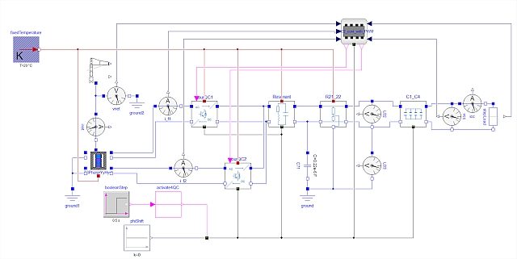

Single Phase Traction Library is a Modelica-based library for high power one phase AC-DC electrical conversion and electrical traction at low-speed switching. The library supports modeling all kinds of stationary and mobile applications. This includes trains and road vehicles with electrical catenaries, such as trolley trucks, and stationary bidirectional AC to DC converters as used for DC sub-distribution stations. The library enhances the Modelica world by detailed and averaged modeling of bidirectional AC/DC converters.
The spectrum of components includes:
- one-phase AC to DC controllers, including three control concepts based on detailed switching and one simplified time-averaged controller,
- one-phase AC/DC active rectifier, detailed switching, and time-averaged one-phase power distribution modeling (overhead line),
- test scenarios for power offtake, including monitors for harmonic testing,
- demonstration for well-to-wheel modeling (detailed switching and time-averaged),
- single component test cases.

{:width="600px"}

Contact: [Aiguo Xu](mailto:aiguo.xu@cnydsimtek.com).
