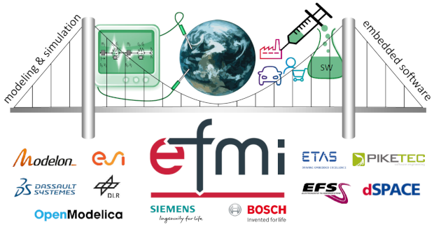

{:width="620px"}

#### MAP eFMI Launched

The Modelica Association project _Functional Mock-up Interface for embedded systems_ (MAP eFMI) has been officially launched. Its mission is to publish, maintain, further improve and promote the eFMI standard, a new _physics modeling to embedded software bridge_ successfully developed and tested in the now finished [ITEA3 research project EMPHYSIS](https://itea3.org/project/emphysis.html).

An overview of EMPHYSIS results, developed tooling, an alpha draft of the eFMI standard and an example eFMU can be found on the [EMPHYSIS webpage](https://emphysis.github.io/); it also provides a [comprehensive set of final review slides](https://emphysis.github.io/pages/downloads/emphysis-itea3-review-slides-excerpt.pdf), motivating eFMI and summarizing the tooling maturity and demonstrators achieved in the EMPHYSIS project.

Within the next months, the final eFMI specification, promotion material and official Modelica library with test scenarios for crosschecking eFMI tooling will be released by MAP eFMI under the umbrella of the [Modelica GitHub group](https://github.com/modelica) and its new [team MAP-eFMI](https://github.com/orgs/modelica/teams/map-efmi).

#### Project Members

MAP eFMI has eleven founding members, all experienced from the EMPHYSIS project, convinced of the future impact of the eFMI standard and obliged to contribute to, and direct, its future development.

The steering Committee members  are (in alphabetic order): Dassault Systèmes, DLR-SR, dSPACE GmbH, ETAS GmbH, ESI ITI GmbH, Modelon AB, Robert Bosch GmbH.

The Advisory Committee members are (in alphabetic order): Elektronische Fahrwerksysteme GmbH, Open Source Modelica Consortium, PikeTec GmbH, Siemens Digital Industries Software.

**Project leader:** Christoff Bürger (Christoff.Buerger@3ds.com)

**Deputy project leader:** Hubertus Tummescheit (Hubertus.Tummescheit@modelon.com)

#### Call for Members

The project is open for further membership applications. If you think your organization should be part of standardizing and leveraging on the _physics modeling to embedded software bridge_ of the Modelica Association, please contact the project leader or deputy project leader.

**In any case, [check the eFMI overview slides](https://emphysis.github.io/pages/downloads/emphysis-itea3-review-slides-excerpt.pdf)!**