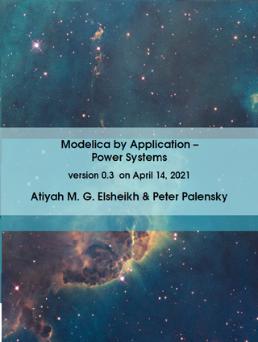

#### About

 The Modelica langauge has clearly attracted a portion of the power system modeling community. Every year there are dozens of works in Modelica addressing modern aspects in power system modeling applications. These applications are facilitated by great capabilities and potentials of the Modelica language. Unfortunately, the majority of interested parties and individuals won't be aware about all such conducted works. Thus, there is always an increasing demand on an educational community-driven up-to-date (e-)book that gathers these works in a well-organized and an entertaining manner. 

#### First release V 1.0 

To appear on the 1st of September 2021

#### Actual outline

The book is currenlty in a good shape, majorly complete up to few subsections. Actual outline can be always accessed 
[here](https://github.com/Mathemodica/ModelicaPowerSystemBook/blob/main/ModelicaPowerSys-outline.pdf). 

#### Scope of readers 

This book serves as a comprehensive but a compact guideline for any 

- Power system modeler desiring a power-system oriented introduction to the Modelica language starting from the big picture up to tiniest modeling implementation details    
- Modelicans aiming at a quick understanding of the potentials of the Modelica langauge for modern challenging aspects of power system modeling applications  

#### Features of the first version V1.0: 

- Available both for free 
- Also available for as-much-as-you-think=this-book-deserve (in the hope to support and encourage similar future initiatives)
- Hopefully to be actualized on a regular basis 
- To enable arbitrary but serious, valuable and concise contributions from interested individuals and parties  

#####  Pre-order version 1.0 or Get actual version & Sponsorship 
 
More detais on the project website on [github](https://github.com/Mathemodica/ModelicaPowerSystemBook/)
