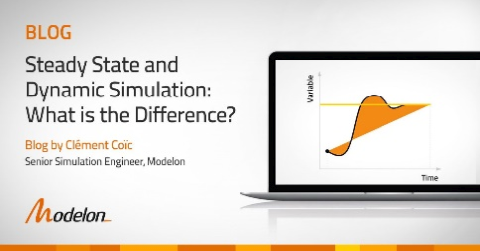

... Image 

#### About

 

The Modelica langauge has clearly attracted a portion of the power system modeling community. Every year there are dozens of works addressing modern aspects 
in power system modeling applications. These applications are facilitated by great capabilities and potentials of the Modelica language. Unfortionately, the 
majority of interested parties and individuals won't be aware about all such conducted works alltogether. Thus, there is always an increasing demand for an 
educational uptodate (e-)book that gathers these works in a well-organized and an entertaining manner. 

#### First release V 1.0 

To appear on 1st of September 2021

#### Actual outline

The book is currenlty in a good shape, majorly complete up to few subsections. Actual outline can be always accessed 
[here](https://github.com/Mathemodica/ModelicaPowerSystemBook/blob/main/ModelicaPowerSys-outline.pdf). 

#### Scope of readers 

This book serves as a comprehensive but a compact guideline for any 

- Power system modeler desiring a quick appreciation of the Modelica language starting from the big picture up to tiniest modeling implementation details    
- Modelicans aiming at a quick understanding the potentials of the Modelica langauge for current challenges of modern aspects of power system modeling applications    

