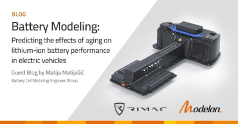
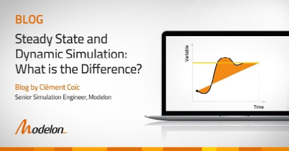
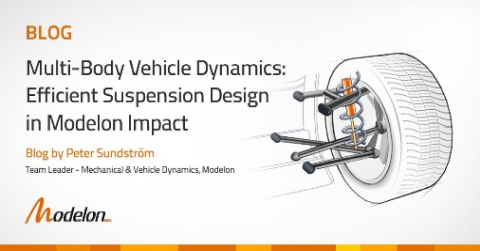

####Battery Modeling: Predicting the Effects of Aging on Lithium-Ion Battery Performance in EVs

 
Rimac Automobili uses the Modelon Electrification Library for accurate battery modeling. Learn more [here](https://www.modelon.com/battery-modeling-electric-vehicles-rimac/).

####Steady State and Dynamic Simulation: What is the Difference?

 
This blog post explains the differences and simplifies the topic of steady state vs dynamic simulation. Learn more [here](https://www.modelon.com/steady-state-and-dynamic-simulation-what-is-the-difference/). 

####Multibody Vehicle Dynamics: Efficient Suspension Design in Modelon Impact

 
Modelon Impact’s Vehicle Dynamics Library, steady-state solver, and multi-execution capabilities make it possible to design and analyze multibody vehicle suspension systems. Learn more [here](https://www.modelon.com/multibody-vehicle-dynamics-suspension-design-in-modelon-impact/). 
