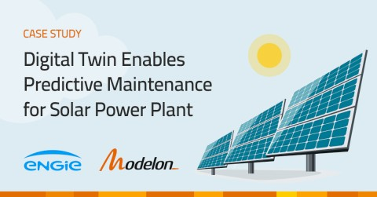

#### Case Study: ENGIE Collaborates With Modelon to Build Solar PV Plant Digital Twin 

Learn how ENGIE successfully collaborated with Modelon to develop a digital twin for predictive maintenance - to monitor performance, anticipate failures, and schedule maintenance. Download the case study [here](https://tinyurl.com/modelon-engie). 

#### Customer Story: SUBARU implements Model-Based Development With Help From Modelon 

Learn how SUBARU’s Electrified Drivetrain Development team successfully implemented model-based development methodologies. Read the full interview [here](https://tinyurl.com/modelon-subaru). 

#### Modelon Blog: More Electric Aircraft

This blog introduces the More Electric Aircraft concept and how modeling and simulation are shaping the way vehicle sub-systems are designed and integrated. Read more [here](https://tinyurl.com/modelon-more-electric-aircraft). 

#### Modelon Blog: Aircraft Landing Gear Design

This blog focuses on building and designing aircraft landing gear using Modelon Impact and the integrated Aircraft Dynamics Library. Read more [here](https://tinyurl.com/modelon-aircraft-landing-gear). 

#### Modelon Blog: Multi-Body Vehicle Dynamics 

This blog focuses on the modeling and simulation of chassis in Modelon Impact. Modelon Impact’s steady-state solver and multi-execution capabilities make it possible to achieve steady-state analysis with speed and precision for multi-body vehicle dynamics. Read more [here](https://tinyurl.com/modelon-chassis). 
