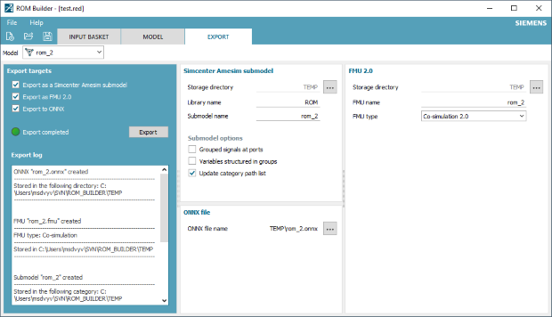

Along with the recent release of [Simcenter Amesim 2021.1](https://www.youtube.com/watch?v=E5GRfV49PWY ), [Siemens Digital Industries Software](https://www.sw.siemens.com/ )  
has introduced a new product, called [Simcenter ROM Builder](https://www.plm.automation.siemens.com/global/en/products/simulation-test/rom-builder.html ), that can typically be leveraged 
as a powerful companion tool to Simcenter Amesim.

# Introducing the Simcenter ROM Builder
The [ROM Builder](https://www.plm.automation.siemens.com/global/en/products/simulation-test/rom-builder.html ) is a general-purpose model order reduction tool. 
It enables creating and exporting Reduced Order Models (ROMs) from various sources of data, including simulation results and measurements. 
This first version is distributed with Simcenter Amesim but is an
independent product. It can be used to extend Simcenter Amesim powerful physical modeling capabilities with advanced model order reduction techniques. 
It represents a first step towards the deployment of highly portable lightweight but accurate representations of physical 
models&nbsp;&mdash;&nbsp;executable digital twins&nbsp;&mdash;&nbsp;to a wide variety of targets (e.g. IIoT, Edge Computing or Cloud platforms), serving various kinds of simulation contexts and purposes.
**Reduced order models can be exported as 2.0 Functional Mock-up Units (FMUs) complying with most of the advanced capabilities of the standard and providing the complete standalone C source code**.

Among the benefits of the model order reduction offered
by the [ROM Builder](https://www.plm.automation.siemens.com/global/en/products/simulation-test/rom-builder.html ), one can mention:

* **Model simplification**, as a means to increase productivity by dealing with reusable fast-running models of limited complexity. Such models can be used   
for control synthesis and validation, or as predictive models inside Model Predictive Controllers (MPC) or Virtual Sensors.
* **Simulation speed-up**: reduced models can for instance replace some participant models within large co-simulations, which helps reduce the overall CPU time.
* **Optimization speed-up**: promising regions of the design space can be quickly identified during a first exploration phase while the results can be refined on the original models.
* **Real-time capability**: reduced order models can help comply with deterministic numbers of iterations (e.g., fixed-step solvers) and simulations that run faster than the wall clock time. 
* **Embedded models / Hardware-in-the-Loop**: reduced order models can be exported to a wide variety of hardware systems including edge computing platforms.
* **IP protection**: a reduced model is a functional, mathematical representation of a model with no direct exposure of know-how or physical equations.

**Please take a look at this first &ldquo;HowTo&rdquo; [video](https://www.youtube.com/watch?v=ub-rdZPi9Y4 ) to discover the capabilities of the Simcenter ROM Builder**.
More will come in the forthcoming 2021.2 release. Stay tuned. 

For more information on Simcenter Amesim and on the Simcenter ROM Builder, 
please visit our [website](https://www.plm.automation.siemens.com/global/en/products/simcenter/ ).
