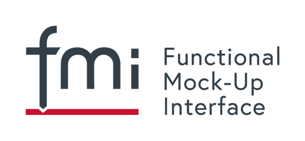

{::options parse_block_html="true" /}

#### FMI Industrial User Meeting – Industrial Usage of FMI and Companion Standards SSP / DCP/ eFMI at the International Modelica Conference 2021

At the [International Modelica Conference in Linköping, Sweden
on Sept. 20-24](https://2021.international.conference.modelica.org/), there will be an FMI Industrial User Meeting – Industrial Usage of FMI and Companion Standards SSP / DCP/ eFMI on **Thursday 23.9.2021, 13:30-17:15.**

For participation please [register for the Modelica Conference](https://www.trippus.se/web/registration/Registration.aspx?view=registration&idcategory=AB0ILBBscfgVo6ZZ4O5u-Bx5_XkKg9Y5J_hMAXgfFYWRClh6asLWnZ_P6iGC5e3_zu9Z7Hyb5Hv_&ln=eng)

##### Preliminary Agenda

* Welcome, Overview on FMI / SSP / DCP / eFMI Standards  (5 Min.)
* Industrial user talks
  *	Initial Steps in Deploying and Calibrating Power System Models on a Synchrophasor Data Cloud Platform using FMI (15 Min., Luigi Vanfretti, Giuseppe Laera, Marcelo de C. Fernandes, Chen Wang, Chetan Mishra and Kevin D. Jones)
  * FMI-based simulation workflows based on open source and commercial tools (15 Min, Christian Bertsch, Fabian Jansen, Andreas Babucke and Torsten Sommer)
  * Open Simulation Platform - Towards a maritime ecosystem for efficient co-simulation (15 Min., Lars Tandle Kylinngstad)
*	FMI3 development (Status, roadmap, layered standards) (15Min., Andreas Junghanns)
*	Demo of FMI3 support in tool prototypes (60 Min.; a list participating tool list will be provided)
*	Short Break (10 Min)
*	Status and outlook SSP Standard (5 Min, Jochen Köhler)
* Industrial user talks
  *	Use of SSP, FMI and OSI for Simulation-based Testing of an Automated Vehicle (15 Min., Jochen Koehler, Heinz Sachsenweger, Arun Das, Markus Deppe and Hans-Martin Heinkel)
  * Model-based development of a traction control unit with SSP and FMI  (15Min., Nicolas Ochoa Lleras, Hasan Esen, Pierre Mai, Klaus Mai and Hiroshi Tashiro)
  * SSP Traceability Demonstrator (15 Min,  Dag Brück, Hans-Martin Heinkel, Peter Lobner and Pierre Mai)
*	Status and Outlook DCP Standard (15 Min, Martin Krammer)
*	Status and Outlook eFMI Standard (15 Min, Christoff Bürger)
*	General Q&A + End
