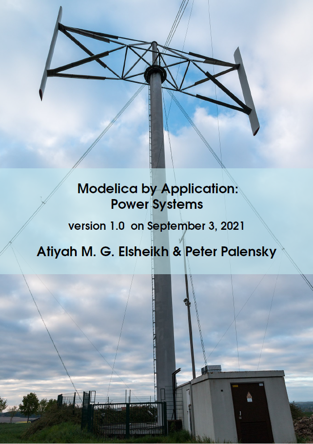

#### Significant updates include:

* Major content and formatting improvment 
* A new chapter with the title "A Short History of System Modeling" 
* An initial draft of a section with the title "Commercial Libraries" 
* Most chapters are ended with topic-related open questions

#####  Intro of Chapter "A Short history of System Modeling"

In the previous chapter, we have gone from classical problems in modeling applications of power systems to modern challenging aspects. 
Analogously, in this and the next chapter, we start from the early modern age of modeling and simulation approaches up to the modeling concepts behind Modelica, leaving the reader to conclude himself after reading this (e-)book, whether and how far both lines are ultimately converging together.  
...

#####  Outline and Ordering details 

View the project website on [github](https://github.com/Mathemodica/ModelicaPowerSystemBook/)

