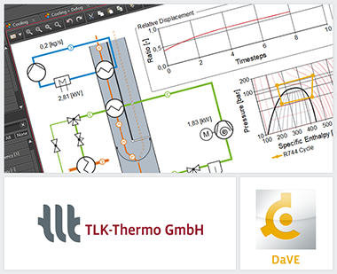

{::options parse_block_html="true" /}

DaVE is a visualization and simulation environment that is suitable for both the post-processing and the online display of dynamic data. The current **version 2.3** contains numerous innovations and improvements, of which only the most important are mentioned below.

 - **Mollier-h-s diagram:** With the h-s diagram, you now have another state diagram at hand with which information on specific enthalpy and entropy as well as temperature, pressure and vapor fraction can be displayed. The Mollier-h-s diagram is used - in addition to the p-h diagram - for example in power plant or refrigeration technology.
 - **Time settings:** New options for data connectors and the DaVE timeline allow for a targeted selection of the data to be handled. By specifying an offset for the time data, individual data connectors can be shifted relatively to each other. This makes it easier to match simulation results with measurement data, for example. The global setting of permissible minimum and maximum times makes it possible to work with slices of long data sources.
 - **New options for instruments:** Various new features are available for the instruments in DaVE. For example, vector plots of TIL components can be created very easily via a new automatic feature. New options - such as the definition of decimal character to be used or the autoscaling of plot axes - allow changing the graphical display to fit the individual needs.
 - **DaVE-LabVIEW-Interface:** The new version of the interface between DaVE and LabVIEW simplifies the data transfer from LabVIEW to DaVE. Any visualizations such as state diagrams, line diagrams and RI schematics with current states can be continuously adapted during measurement operation without changing the LabVIEW measurement program. During the development of the interface, special attention was paid to simple integration into existing LabVIEW programs. Experiences from our in-house measuring operation have also been incorporated in this process.

For further information see [www.tlk-thermo.com](https://www.tlk-thermo.com/index.php/en/dave), [download the DaVE presentation](https://www.tlk-thermo.com/images/tlk/content/presentations/DaVE_EN_2020_September.pdf) or contact us at [dave@tlk-thermo.com](mailto:dave@tlk-thermo.com).
