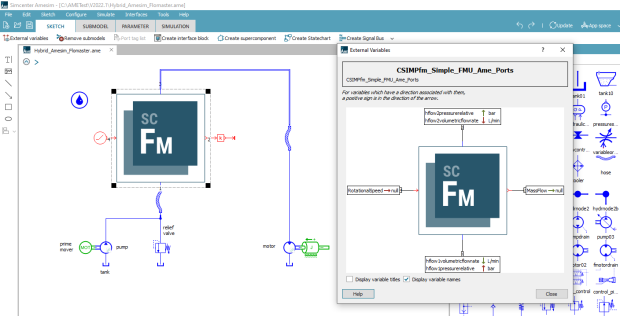

[Siemens Digital Industries Software](https://www.sw.siemens.com/ ) is proud to announce the recent releases 
of [Simcenter Amesim 2021.2 and Simcenter Flomaster 2021.2](https://www.youtube.com/watch?v=gQpT35UQYA0 ). 
These releases represent an important step towards more synergies between our system simulation solutions, in which the FMI standard plays an important role, as shown hereafter. 

As an early adopter of the FMI standard, [Siemens Digital Industries Software](https://www.sw.siemens.com/ ) has decided to offer its customers one of the most awaited features of the FMI 3.0 standard right away. 
Indeed, the <b>Ports and Icons</b> feature that was [announced](https://fmi-standard.org/news/2018/05/30/fmi-3-0-alpha-feature-list.html ) by the FMI Steering Committee in 2018 
has the advantage of being fully backwards compatible with the 2.0 version of the FMI standard. Therefore, and in the spirit of the &ldquo;Stability&rdquo; 
[Guiding Principle](https://github.com/modelica/fmi-standard.org/blob/master/assets/FMI_DevelopmentProcess_1.0.pdf ) of the FMI standard development, it has been leveraged already to increase
the interoperability between Simcenter system simulation tools. As concrete major outcome, Simcenter Flomaster 2.0 FMUs can optionally be equipped with physical ports when imported 
into Simcenter Amesim, enabling direct connections with hydraulic or thermal-hydraulic components, which also ensures a build-in coherence between physical units.

By being able to connect Simcenter Flomaster FMUs directly to their Simcenter Amesim fluid components, users can benefit from the rich capabilities of the low-level FMI standard 
interface <i>augmented</i> with an improved interoperability and usability within the Simcenter system simulation ecosystem.

For more information on Simcenter system simulation solutions, 
please visit our [website](https://www.plm.automation.siemens.com/global/en/products/simcenter/simcenter-system-simulation.html ).
