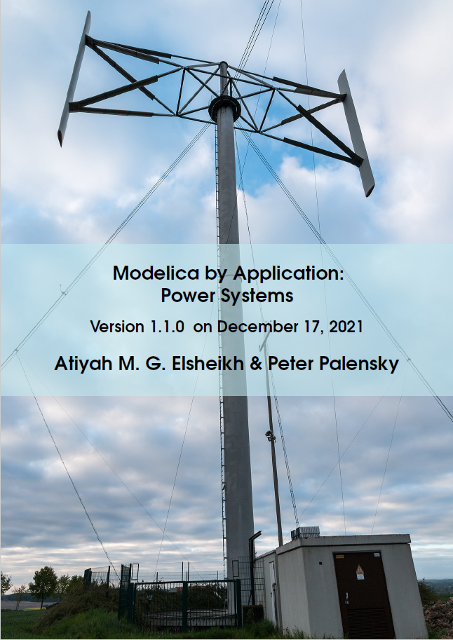

#### Significant updates include:

* Announcing the project's scientific platform of the e-book on [ResearchGate](https://www.researchgate.net/project/Book-Modelica-By-Application-Power-Systems) serving as a transparent public platform for reporting related publications, discussing the contents and providing feedback
* Major enhancements majorly based on publications of the last Modelica conference 2021 and recent journals 
    * (1 New chapter, major changes in 4 chapters, minor changes in 4 chapters, +16 pages, +~ 50 references)
* A new chapter with the title *"Promising Methods and Technologies"*
* Many chapters are ended with a subsection for *suggested reading*   

####  Outline & Ordering details 

View the project website on [github](https://github.com/Mathemodica/ModelicaPowerSystemBook/)

