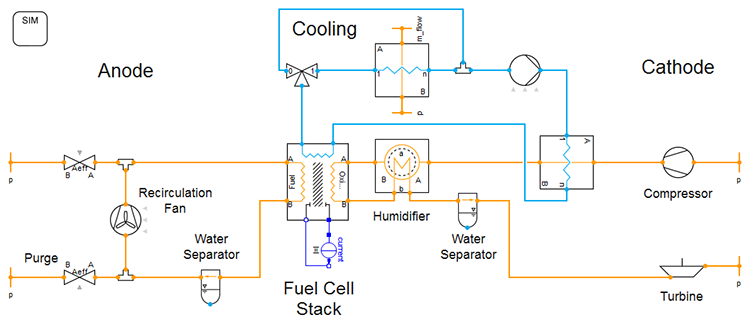

*Models for various types of fuel cells and electrolyzers are being developed in TIL add-on library 'Hydrogen Energy Systems'. Together with the additionally included balance-of-plant models - for humidifiers, water separators, valves, pipelines as well as various turbomachines - the library enables steady-state and dynamic system simulations all around the fuel cell.*

At the heart of the simulation of a fuel cell system - based on our TIL add-on library 'Hydrogen Energy Systems' - is a flexible and easy-to-parameterize stack model.

*Fuel cell system diagram with stack model (center) anode (left) and cathode supply (right) and simple cooling (top)*

Due to the numerically robust modeling of the component and system models, such a system can be efficiently simulated under both steady-state and dynamic operating conditions. Flexible base models for PEMFC and SOFC stacks are available in the TIL add-on. These contain basic, fundamental reaction equations of the electrochemical cells. Thanks to the TILMedia substance data library, chemical and electrochemical reactions in the fuel cell models can be balanced precisely and extremely quickly in terms of energy.

More detailed information can be found at [www.tlk-thermo.com](https://www.tlk-thermo.com/index.php/en/company/news-from-tlk#H2)

For further information about TIL Suite see [www.tlk-thermo.com](https://www.tlk-thermo.com/index.php/en/software-products/til-suite)
