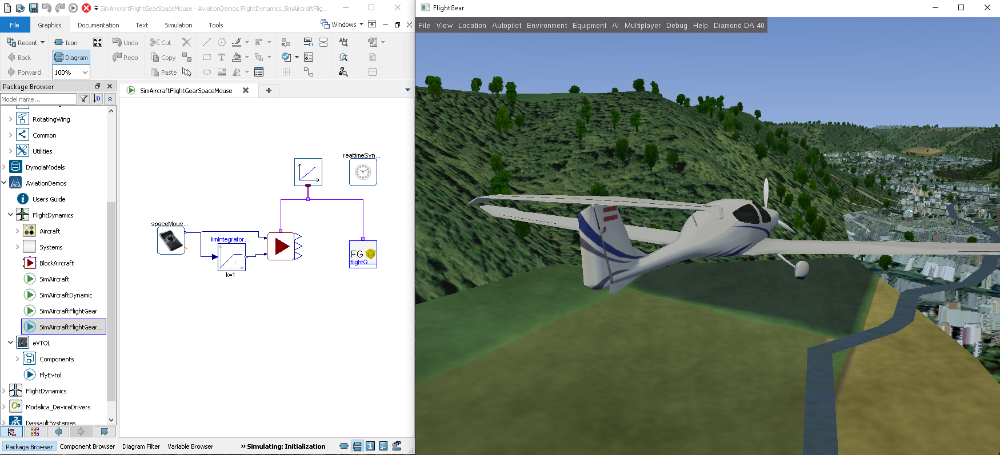

Since version 2022 Dymola ships with the Aviation Demos package. It showcases the usage of the Aviation Systems Library (ASL) together with other libraries:

 - The DLR FlightDynamics Library allows the connection to the Open-Source FlightGear simulator for visualization
 - With the Dassault Systèmes Hydrogen Library the full flight envelope of a fuel-cell-powered electrical vertical take-off and landing aircraft (eVTOL) can be simulated

{:width="623px"}

The physical models of the Aviation Systems Library (ASL) are compatible with the FlightDynamics Library and integrate into its bus structure. Thus tools and workflows compatible to the FlightDynamics Library can be used with models from the Aviation Systems Library. While the ASL focuses on the behaviour of the arrangement of aerodynamic surfaces, FlightDynamics Library integrates the model into a global coordinate system and calculates the variables necessary for controller design. Also, it ships with an interface to the FlightGear simulator. The current telemetry data of the simulation is sent by UDP to FlightGear for 3D visualization.

All propulsion models of the ASL use common interfaces from the DassaultSystemes Library to allow compatibility between the domain-specific libraries developed by Dassault Systèmes. In the eVTOL demo, the simple energy supply model is replaced by a fuel cell from the Hydrogen Library to allow consumption investigation on different flight missions of a hydrogen-powered eVTOL.
