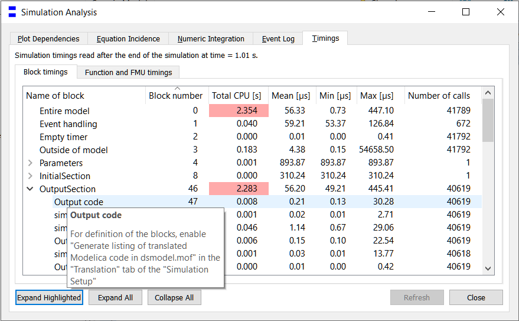
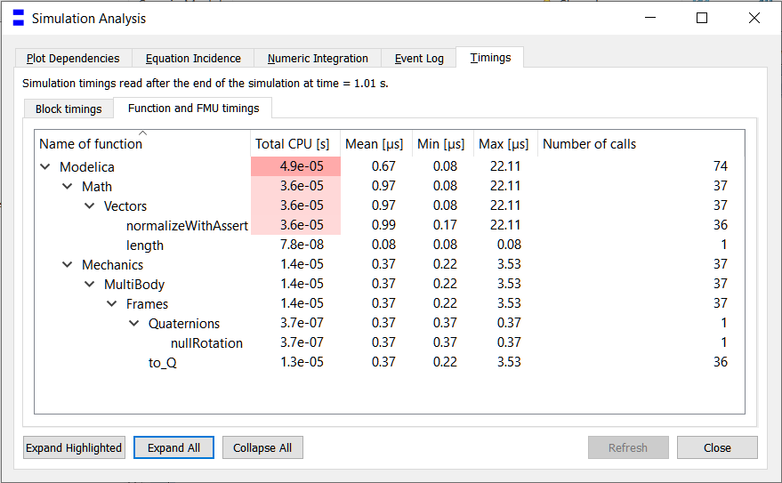
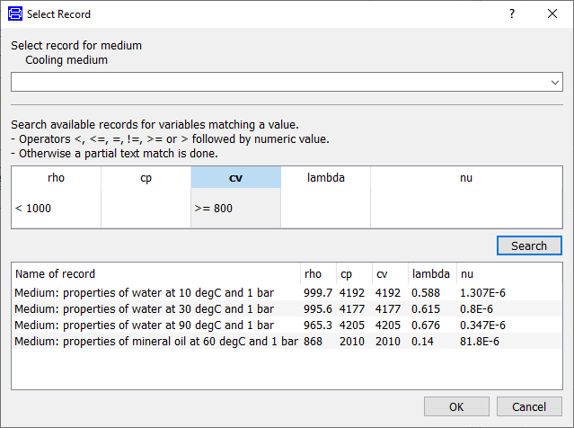

We are pleased to announce that Dymola 2023 will be available in May 2022. 

#### Simulation

Simulation Analysis has been extended with detailed timer statistics, helping to pinpoint any bottlenecks in your simulation. It offers two views, both detailing
execution time in seconds as well as the number of calls. Hotspots are highlighted in red. The first view groups the simulation code into logical sections.
{:width="623px"}

The second view shows individual function calls, and if FMUs are included in the model, it will show the distribution for each FMI-function.
{:width="623px"} 

#### Developing models

In many thermo-fluid applications, there is a need to parameterize the model with for example a medium model. Finding the right medium model is now easier, 
as the user interface has a search capability that allows matching records that meet certain constraints.

{:width="623px"}  

#### SSP/eFMI

Dymola 2023 has support for both import and export in the SSP format (System Structure and Parameterization). SSP export will create an SSP file with embedded FMUs for any component models. For Modelica models, the system description that contain references to the Modelica model. Meta data defined in the Modelica model will be exported as an annotation.

Dymola supports eFMI according to the latest publicly available eFMI specification. Dymola’s eFMI facilities comprise generation of eFMUs with Algorithm Code, Production Code and Binary Code containers and supports the usage of generated eFMUs for co-simulation from within Modelica models. A Dymola Source Code Export license is required to support eFMI.

