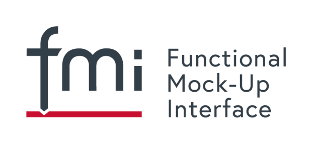

{::options parse_block_html="true" /}

The FMI 3.0 standard is currently in Beta.5 stage. 
The release candididate RC.1 is in preparation and shall be published beginning of April 2022.

Everyone is encouraged to perform a final inspection to the current version of the FMI 3.0 standard (see https://github.com/modelica/fmi-standard) and report findings NOW.

In a (7th and last) FMI 3.0 plugfest on April 5th/6th final tests of protoype implementations will be performed. Tool vendors are very welcome to participate.

The release of FMI 3.0 is planned for May 2022.
