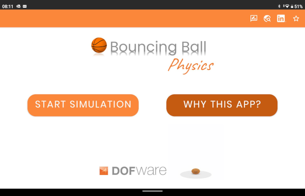

Dofware has released a mobile app exploiting Modelica features. It is named Bouncing Ball Physics and reproduces the physics governing the behavior of a bouncing ball. Once defined the properties of the ball and of the ground, and after stating the starting conditions of the ball, the user can follow its dynamic behavior.

For the sake of simplicity, a Modelica basic tutorial example has been adopted. The ball is a digital twin of a real object. Although implementing simple physics, it contains some meaningful applications of Modelica features (events, hysteresis, etc.). The same technology could be extended to any kind of complex systems easily.

The virtual model has been implemented by and exported from Dymola framework. The algorithm processes the parameters set by the user and provides a quick and reliable simulation as a result, showing how a real ball would behave under the same conditions. Results may be saved into the app-related database, and, additionally, may be exported to any external device.

The Bouncing Ball Physics app is the demonstration of how Modelica is a flexible and versatile tool, which enables to run physical models on any platform, no matter the needs and the complexity of the models.
