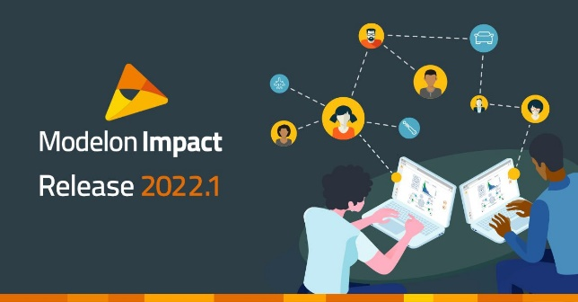
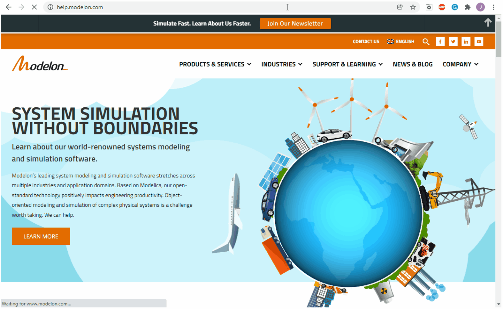

#### Modelon 2022.1 Release: Now Available

Notable new features and updates in the Modelon 2022.1 Release include the Modelon Help Center, workspace configuration management, and quick-start example models. View the release highlights [here](https://bit.ly/3J5Lwch). 

#### Modelon Help Center: Now Available Online

From getting started to how-to guides and step-by-step tutorials, access comprehensive support resources through the Modelon Help Center. This is now the central resource for anyone to receive self-service help and find answers to their most frequently asked questions. View the Modelon Help Center [here](https://bit.ly/36losrD). 

#### Modelon Innovate 2022: Mark Your Calendars!

Join us in Stockholm on October 19-20 at Modelon Innovate 2022 - a free, two-day conference for simulation engineering professionals and Modelon customers around the globe. From inspirational keynotes by leading companies to training courses led by Modelon experts, discover how you can better leverage system simulation to produce innovative technology. Register [here](https://bit.ly/3u2vPfw). 
