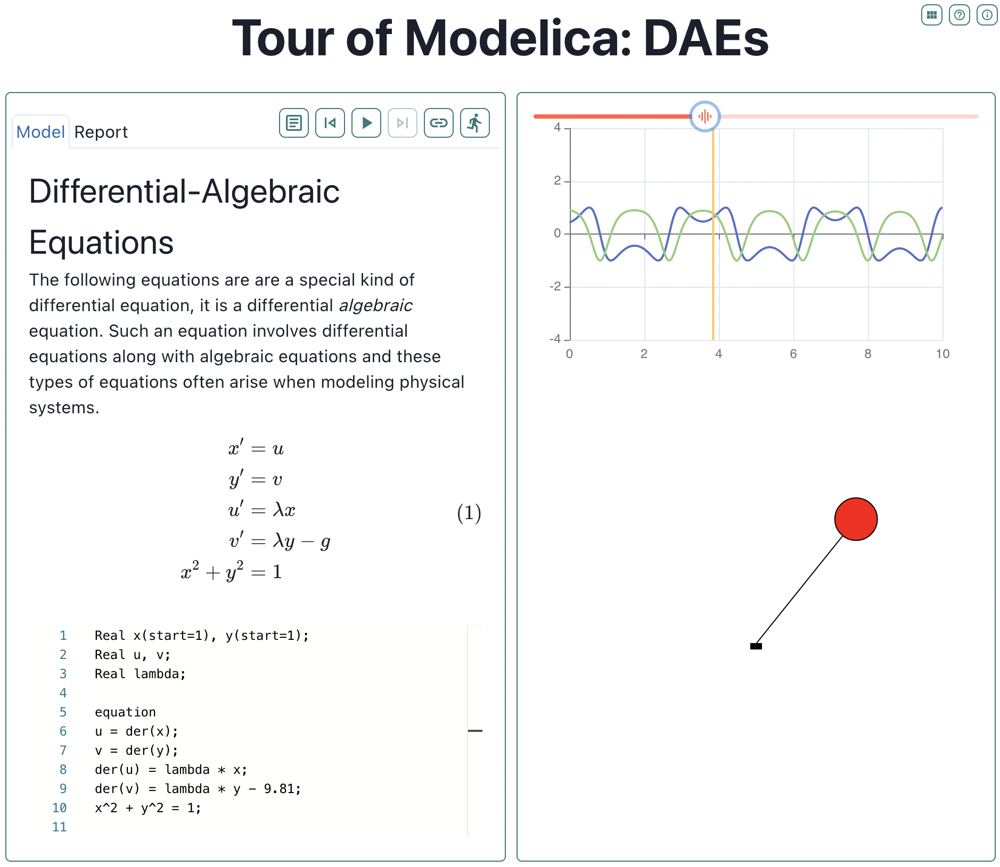

#### Modelica Playground on the Web

Many languages feature a web-based "playground" where peopple
can try out the language, see some examples or find explanations
of various languages features...so why not Modelica?

For this reason, I create a site that allows you to type in Modelica
code and evaluate it without having to install any tools. Although
it doesn't include any of the usual diagram display or editing capabilities,
it still includes all the power of the Modelica language for solving
algebraic, non-linear, or differential-algebraic equations thanks to the
OpenModelica compiler running behind the scenes.

Feel free to just play around with the application. You'll find several examples
of how to use the application and even [a guide on how to create your own
content](https://playground.modelica.university/?toc=howto.json)
(both individual examples or entire collections of examples).  An example
is this ["tour" of various Modelica related features](https://playground.modelica.university/?toc=tour.json).

While exploring the content on this site, you'll see that this application supports
some interesting post-processing possibilities which includes things like embedded
LaTeX equations, plots, tables and animations (both 2D and 3d).

