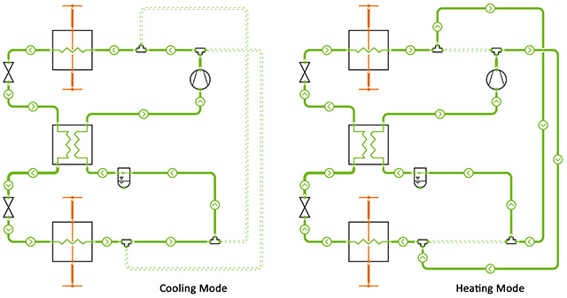

DaVE is a visualization and FMI-based simulation environment for both the post-processing and the online display of dynamic data sets. It is specifically suitable to analyse and compare simulation results of Modelica models.

Besides standard plot instruments, such as 2D-plot, vector plots or bar charts, DaVE includes various thermodynamic state diagrams, as for instance Pressure-enthalpy (ph) or Temperature-enthalpy (Th) diagrams of refrigerants, but also hx-charts for moist air. The cycle points from Modelica simulations can automatically be loaded into the diagrams, which makes DaVE specifically suitable to analyse refrigeration and heat pump systems.

DaVE supports the creation of P&I flow diagrams. The connecting lines between the individual symbols can be linked with variables and thus dynamically change their width and direction. Furthermore, the connecting lines can be (de)activated, which is for instance suitable to analyse reversible heat pump systems.

**Example of a reversible heat pump configuration in DaVE**

The new version 2.5 of DaVE include the following new features:
 - Comfort zones of summer and winter can be added to hx-Chart
 - Topology of systems in P&I flow diagrams can be (de)activated using variables coming from Modelica or FMU simulation
 - New fluid property data, using TILMedia 3.11.0

For further information see [www.tlk-thermo.com](https://www.tlk-thermo.com/index.php/en/dave), [download the DaVE presentation](https://www.tlk-thermo.com/images/tlk/content/presentations/DaVE_EN_2020_September.pdf) or contact us at [dave@tlk-thermo.com](mailto:dave@tlk-thermo.com)
