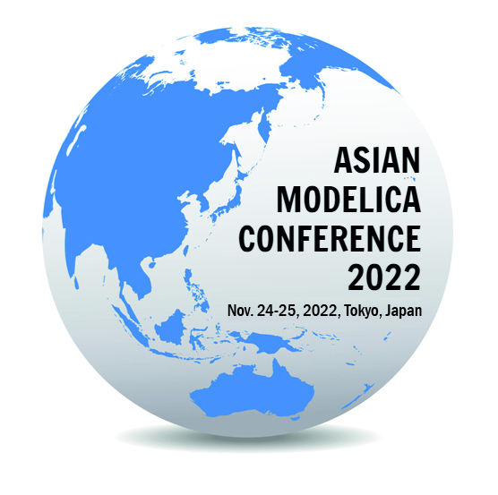

We are happy to announce that [The Asian Modelica Conference 2022](https://2022.asian.conference.modelica.org/) will be held as a hybrid  event on November 24–25, 2022. It is organized by [Modelica Association](https://modelica.org/) in cooperation with [Sophia University](https://www.sophia.ac.jp/) and [Modelon](https://modelon.com/). The conference venue is inside the Yotsuya campus of Sophia University in Tokyo, Japan. With this change, we are able to provide physical booth to sponsors and arrange conference dinner for on-site participants. 

The Modelica Conference will cover modeling of complex physical and cyber-physical systems as well as tools, for a wide range of research and industrial applications. The Modelica Conference is the main event for users, library developers, tool vendors and language designers to share their knowledge and learn about the latest scientific and industrial progress related to Modelica and to the Functional Mock-up Interface (FMI).

Important dates information is listed below,

- Full papers submission: August 21, 2022
- Notification of acceptance: September 30, 2022
- Final papers submission: October 15, 2022

More details about the “call for papers” can be found in the [conference site](https://2022.asian.conference.modelica.org/) or directly at [EasyChair AsianModelicaConference 2022](https://easychair.org/my/conference?conf=modelica2022asian).

Tielong Shen, Yutaka Hirano, Rui Gao

The Organizers
