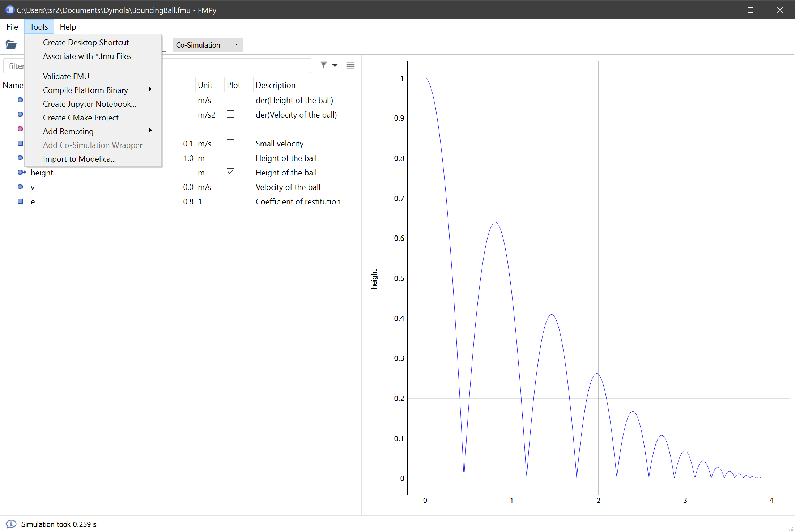
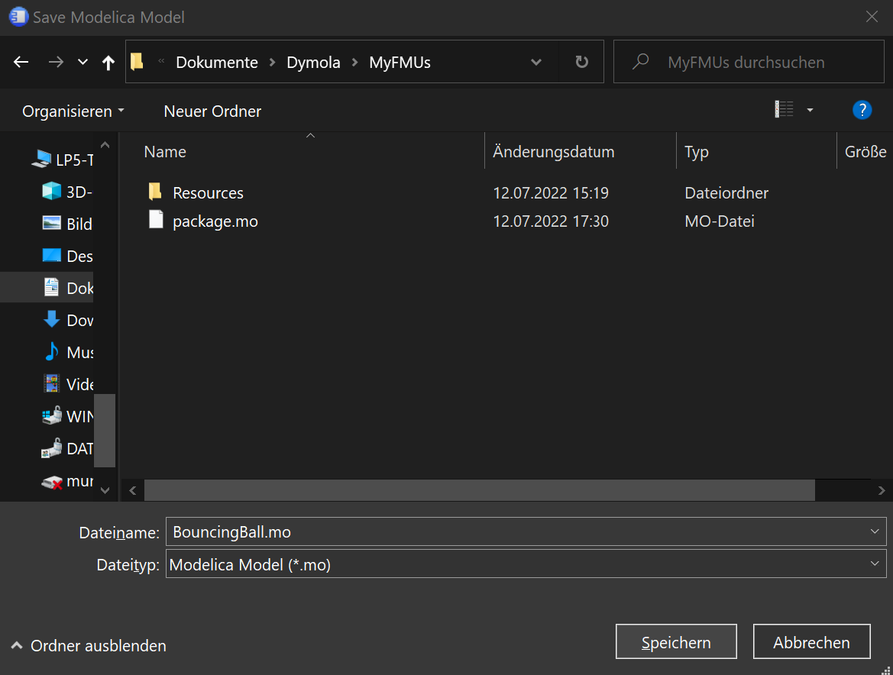
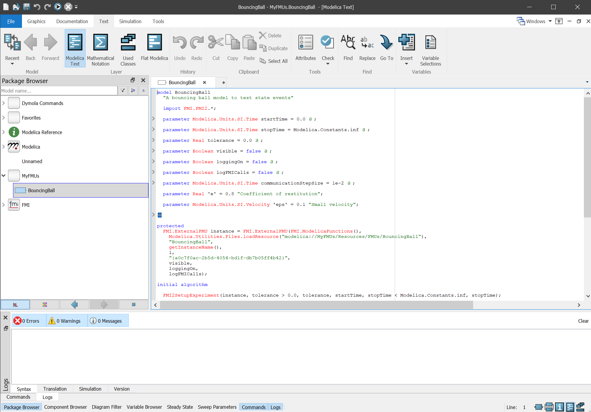

#### Generic FMU import for Modelica in FMPy

FMPy [0.3.11](https://github.com/CATIA-Systems/FMPy/releases/tag/v0.3.11) introduces a generic FMU import for Modelica.

To import an FMU open the it in the FMPy GUI and select `Tools > Import to Modelica...` and save the `*.mo` into an existing Modelica package directory.

Based on the interface type selected in the GUI a Model Exchange or Co-Simulation model will be generated that depends only on the `FMI` library that ships with FMPy.
The `FMI` library is located in `<Installation Path>/modelica/FMI/package.mo`.
To get `<Intallation Path>` select `Help > About FMPy`. 

