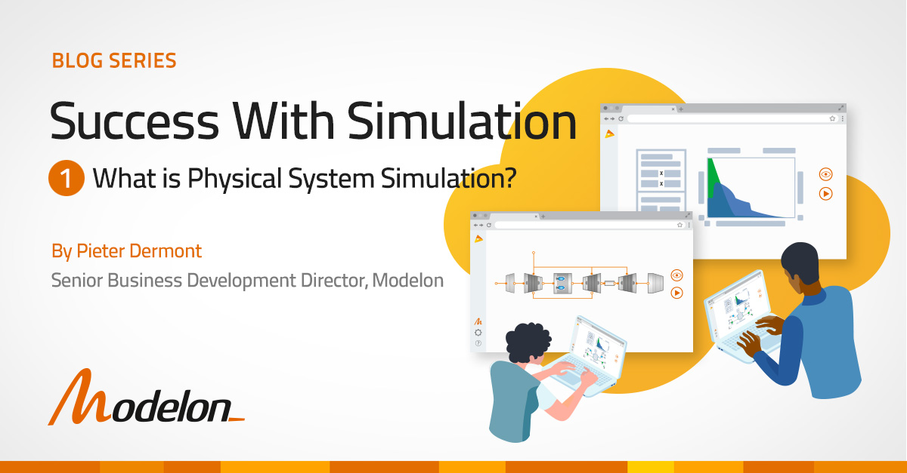

#### New Case Study: Fast-Tracking All-Electric Solar Driving With System Simulation

To build an innovative all-electric solar vehicle from scratch and launch it on time, Lightyear turned to Modelon’s system simulation technology to make the right product development decisions. Read more [here.](https://modelon.com/support/lightyear-solar-vehicle-system-simulation/)   

#### Modelon Blog: Trends in Energy Technologies for 2022

Are you up to date with the energy trends of today? In this blog, Modelon’s Industry Director for Energy and Process shares his observations and insights on energy technology trends for 2022. Read more [here.](https://modelon.com/energy-technologies-trends-2022/)  

#### Modelon Blog: What is Physical System Simulation? 

In the first blog of the Success with Simulation series, learn what physical system simulation is, what it is not, and what it can do for your organization. Read more [here.](https://modelon.com/system-simulation-what-is-physical-system-simulation/) 

#### Modelon Blog: Hybrid Electric Propulsion Systems: Modeling the Backbone of Electric Aircraft 

The first installation of our Sustainable Aviation blog series focuses on modeling and simulating fuel savings and increased flight range, powered by hybrid electric propulsion systems. Read more [here.](https://modelon.com/hybrid-electric-propulsion-systems/)  
