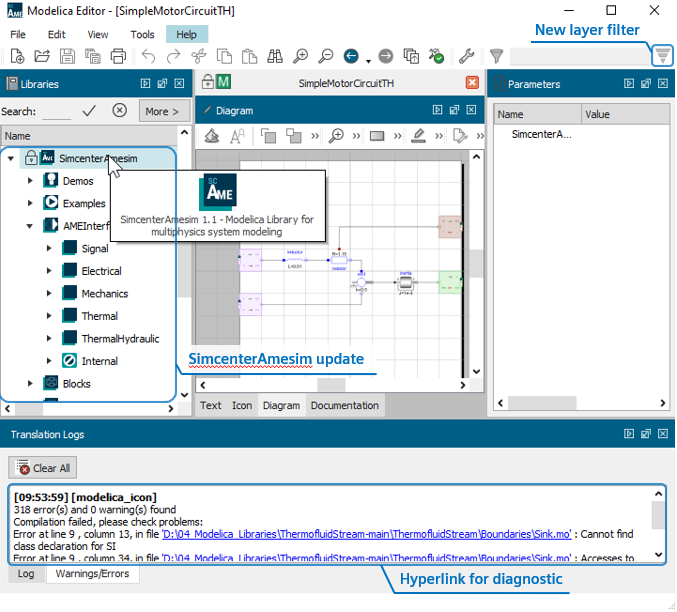

[Siemens Digital Industries Software](https://www.sw.siemens.com/ ) is proud to announce that Simcenter Amesim 2022.1 is available since April 2022, as part of its system simulation solutions. Among the key features introduced in this release, we can highlight the Modelica related improvements below.

#### Modelica Editor 2022.1
Modelica Editor is an integrated development application dedicated to editing Modelica code. More than a tool to be used during the design and modeling phase of a Modelica model, Modelica Editor allows you to generate bridges between the **acausal** world of Modelica and the **causal** environment of Amesim.

The improvements introduced in Modelica Editor 2022.1 are the following:
* Modelica Compiler (Modelon’s Optimica Compiler Toolkit) upgraded to version 1.32.
* The Modelica Standard Library 4.0.0 in now supported, with an exception for the **Clocked** package.
* The standardized **SimcenterAmesim** Modelica library has been upgraded to the version 1.1, containing now the **array** interfaces, **Thermal Hydraulic** interfaces and new demos to show how connect these two worlds via standardized physical interfaces.
* A new filter button in the toolbar helping the user to expose only the parameters and variables of the top layers of his models.
* Improved translation logs that now provide clearer messages with hyperlinks for easy diagnosis.

And thanks to the Media Properties Assistant provided in the **Thermal Hydraulic** Amesim Library, the media can be adjusted according to the properties described in the Modelica code, thus obtaining continuous thermodynamic properties between both worlds.

For more information on Simcenter Amesim, please visit our [website](https://www.plm.automation.siemens.com/global/fr/products/simcenter/simcenter-amesim.html).
