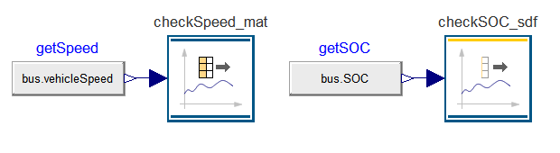

The Testing library allows to create test models graphically and run them in Dymola.
All libraries developed by Dassault Systèmes are using it to test several hundreds of test models with thousands of test cases.

The latest Testing version v1.6.0 is available with Dymola 2023x and it remarkably improved the creation of reference results.

- __New file formats:__ In addition to the previously supported .sdf format users can now also record their references into .mat and .txt files (used my MSL's CombiTimeTable).
  Switching between formats is easy: Just change the extension in the path to the reference file and record new references. No model changes are needed.

- __Clean results:__ The burden of manually deleting unwanted trajectories form the recorded reference has now been eliminated. Unnecessary trajectories are automatically removed, so no manual steps are needed anymore (in previous version one had to cleanup the files with the SDF Editor).

- __Trajectory filtering:__ Constant segments in recorded trajectories can be filtered. This can dramatically decrease the file size.

We encourage you to try out the latest version now, which is available with the standard Dymola license. 
To get started, read the User's Guide of the library or check out [this blog post](https://www.claytex.com/tech-blog/testing-library-a-look-inside/) by Claytex.

