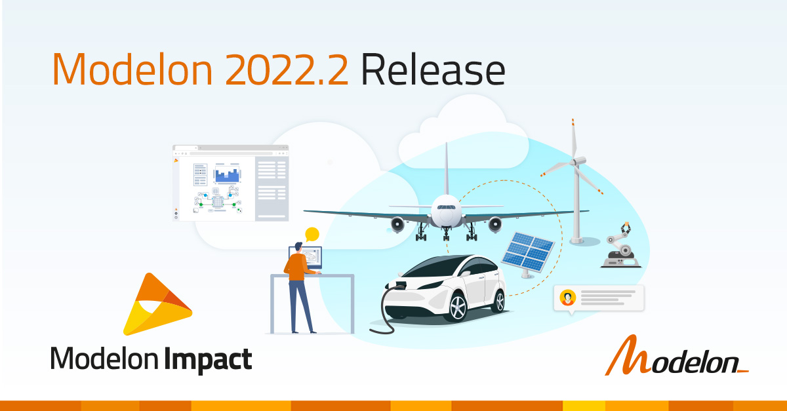
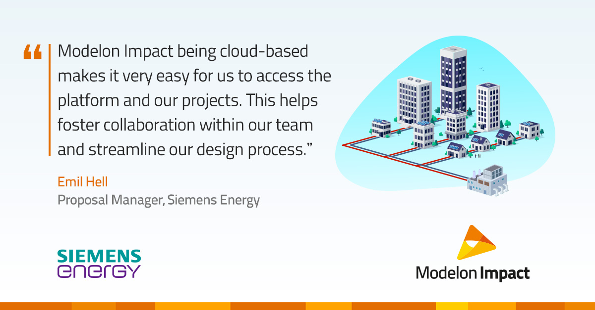
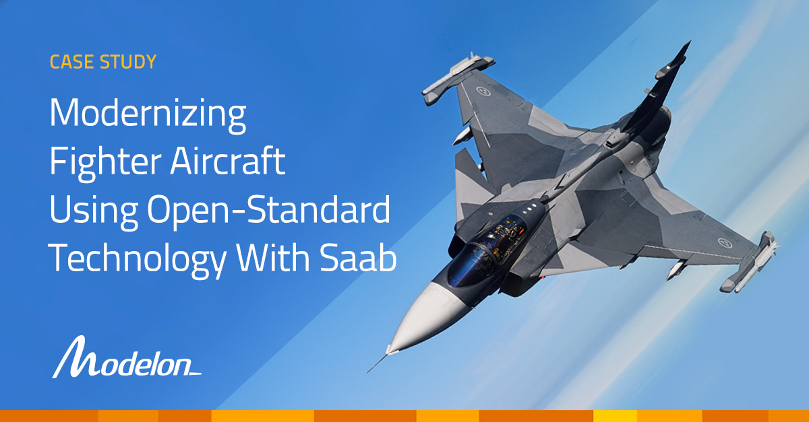

Modelon is revolutionizing the engineering design industry by offering technologies and services that enable customers to leverage system simulation. Modelon’s flagship product, [Modelon Impact](https://modelon.com/modelon-impact/), is a cloud system simulation platform that helps engineers virtually design, analyze, and simulate physical systems.

Visit [https://modelon.com](https://modelon.com/) for more information. 

Follow us on [LinkedIn.](https://www.linkedin.com/company/modelon)

### Modelon Impact 2022.2 Release Now Available 

We’re happy to announce one of our biggest releases – Modelon Impact Cloud, our system simulation platform accessible via public cloud. 
Read the full release announcement [here.](https://modelon.com/modelon-2022-2-release-system-simulation-on-the-cloud-has-arrived/)
Watch the Modelon Impact explainer video [here.](https://www.youtube.com/watch?v=bRPqP9H07co&t=2s)

### Modelon Case Studies

#### Lightyear and Modelon: Fast-Tracking All-Electric Solar Driving With System Simulation 

Time is valuable, especially for a company such as Lightyear to build and bring to market a cutting-edge solar-electric vehicle. With Modelon Impact, Lightyear reduced its overall system design and simulation time while making smarter development decisions along the way. [Read the case study.](https://modelon.com/support/lightyear-solar-vehicle-system-simulation/) 

#### Siemens Energy and Modelon: Adapting to the Future of Energy Technology with System Simulation 

Siemens Energy needed to improve and further develop its heat pumps to ensure the performance and design of the integrated systems worked efficiently before moving forward with deployment. 
In our new case study, learn how Siemens Energy integrated its advanced energy systems with its existing heat pump technology using Modelon Impact. [Read the case study.](https://modelon.com/support/heat-pump-technology-adapting-to-the-future-with-system-simulation/) 

#### Saab and Modelon: Modernizing Fighter Aircraft with Open-Standard Technology 

In 1988, Saab made history with the Gripen - the first multirole fighter aircraft developed in Sweden to take flight. Since its initial development, Saab has been tasked with making iterations of the Gripen, which are each more powerful and technologically advanced than before. 
 
This case study explains how Saab worked with Modelon to incorporate MBSE and greatly enhance the Gripen without overextending its in-house resources. [Read the case study.](https://modelon.com/support/modernizing-fighter-aircraft-with-open-standard-technology/)

### New Training Content in Modelon Help Center

The Modelon Help Center is a public resource for Modelon Impact users, simulation and modeling professionals, Modelica modelers, and students to leverage the expertise that Modelon’s experts have to offer. Access guides and material for Modelon Impact and Modelon libraries within the energy & process, automotive, aerospace, and industrial equipment industries. 

We’ve now [released training material](https://help.modelon.com/latest/landing_pages/modelon_innovate_content_page/) from our most recent global conference, Modelon Innovate. From learning how to use advanced workflows to simulating industry-specific applications, Modelon Help Center users can now access all the latest content from the conference. 

### Blogs

#### Trends in Energy Technology for 2022 

This blog describes the trends and observations of innovative energy technologies in 2022 and beyond. With over 20 years of experience in model-based engineering, Modelon’s Energy and Process Industry Director, Stéphane Velut, shares his views on energy technologies trends, observations & insights – with a focus on what he is seeing in the industry and how simulation software is enabling world-leading organizations to get ahead. [Read the blog.](https://modelon.com/energy-technologies-trends-2022/)

#### What is Physical System Simulation? 

Physical system simulation is an elusive concept –yet on your journey to virtualize the product design process, there is no way around it. In the first blog of the Success with Simulation series, PieterDermont, Modelon’s Senior Business Development Director, covers what physical system simulation is, what it is not (hint, it is not “systems engineering”), and what it can do for your organization. [Read the blog.](https://modelon.com/system-simulation-what-is-physical-system-simulation/)

#### Hybrid Electric Propulsion Systems: Modeling the Backbone of Electric Aircraft 

Part one of the Sustainable Aviation Blog Series. Developing technologies to enable more sustainable aviation for the aerospace industry is a crucial challenge that engineers are trying to overcome. This blog focuses on modeling and simulating fuel savings and increased flight range which is powered by hybrid electric propulsion systems. [Read the blog.](https://modelon.com/hybrid-electric-propulsion-systems/)

#### Direct Air Capture: Seizing Emissions to Achieve Climate Targets 

Direct Air Capture (DAC) is a technology that captures and scrubs carbon dioxide from the atmosphere. In this blog, learn the DAC process step-by-step and how this technology can be integrated into current systems by simulating prebuilt model examples in Modelon Impact. [Read the blog.](https://modelon.com/direct-air-capture-seizing-emissions-to-achieve-climate-targets/)  

