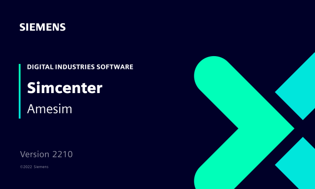

[Siemens Digital Industries Software](https://www.sw.siemens.com/ ) is proud to announce the recent release of [Simcenter Amesim 2210](https://www.plm.automation.siemens.com/global/en/products/simcenter/simcenter-amesim.html ), as part of its [system simulation solutions](https://www.youtube.com/watch?v=PNvEug8pcDM ). Among the key features introduced in this release, we can highlight the FMI improvements below.

- **Leveraging Windows to Linux cross-compilation using FMI:** with Simcenter Amesim 2210, you can create and share components with Linux users directly, from a 100% Windows ecosystem, without revealing any source code. [More details](amesim_details.html).
  - Direct export, from Windows, of FMUs usable under Linux 64-bit
  - Improved workflow for FMI based Linux 64-bit real-time targets
  - Support of NI Linux Real Time OS (Intel x64) via FMI
- **Export of FMUs via a dedicated Python script:** a new Python script allows exporting FMUs “offline” i.e., without having to open the Simcenter Amesim GUI. [More details](amesim_details.html).
- **Improved support of units and non-Latin titles:** for an improved handling of exported FMUs, the units are now automatically declared and converted to the International System of Units. [More details](amesim_details.html).
- **Towards FMI 3.0**
In addition to the [“FMI terminals”](https://newsletter.modelica.org/2021-03/index#fmi-physical-terminals-between-simcenter-amesim-and-simcenter-flomaster ) feature, already supported by [Simcenter Amesim](https://www.plm.automation.siemens.com/global/fr/products/simcenter/simcenter-amesim.html ) and [Simcenter Flomaster](https://www.plm.automation.siemens.com/global/en/products/simcenter/flomaster.html ), [Siemens Digital Industries Software](https://www.sw.siemens.com/ ) plans to implement the support of FMI 3.0 in the forthcoming releases of its system simulation solutions. Stay tuned!

For more information on Simcenter Amesim, please check this [blog post](https://blogs.sw.siemens.com/simcenter/whats-new-in-simcenter-system-simulation-2210/ ).
